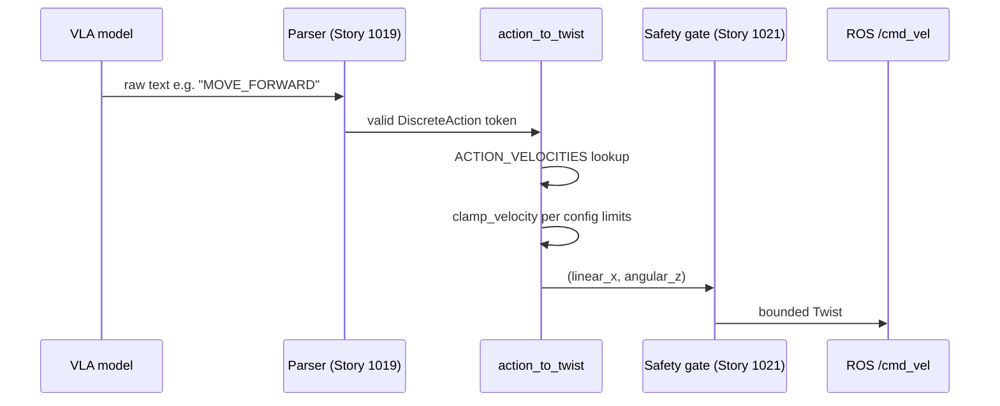
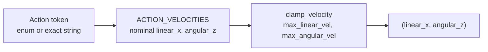

# Discrete action schema

**Epic:** Action Interface, Parser, and Safety Layer (103) · **Jira:** VLA-29 / Story 1017

**Human-readable version (browser):** [`action-schema.html`](action-schema.html)

## Purpose and fit

Story 1017 defines the **first shared contract** between the VLA model and robot control in Lite-VLA. The model is not allowed to output raw velocities in the MVP; it must output one of five uppercase **discrete action tokens**. This task turns that vocabulary into code so every downstream module — parser, safety layer, dataset labeling, prompts, and the dummy pipeline — speaks the same language.

Without this schema, each team would invent its own action names (`FORWARD` vs `MOVE_FORWARD`) and velocity mappings. That makes training labels inconsistent, parser tests brittle, and ROS integration unsafe. This story establishes the canonical module: `litevla.actions`.

In the epic pipeline, this story sits **before** the parser (Story 1019) and the dedicated safety gate (Story 1021). It answers: *given a valid action token, what bounded `(linear_x, angular_z)` values should we request?*

## Reader map

Read in this order when onboarding to the implementation:

1. [`docs/mvp_definition.md`](../../mvp_definition.md) — why discrete actions exist and MVP acceptance criteria for parsing/safety.
2. [`litevla/actions/schema.py`](../../../litevla/actions/schema.py) — enum, velocity table, and mapping helpers (core logic).
3. [`litevla/actions/__init__.py`](../../../litevla/actions/__init__.py) — public re-exports used by scripts and future ROS nodes.
4. [`tests/test_action_schema.py`](../../../tests/test_action_schema.py) — expected behavior encoded as tests.
5. [`scripts/run_dummy_pipeline.py`](../../../scripts/run_dummy_pipeline.py) — end-to-end example that loads config safety limits and prints mapped commands.
6. [`configs/default.example.yaml`](../../../configs/default.example.yaml) — `safety.max_linear_vel` and `safety.max_angular_vel` consumed by `action_to_twist`.

## Allowed actions

| Action | Meaning | Nominal `linear_x` (m/s) | Nominal `angular_z` (rad/s) |
|--------|---------|--------------------------|-----------------------------|
| `MOVE_FORWARD` | Drive toward the goal | 0.2 | 0.0 |
| `TURN_LEFT` | Rotate left in place | 0.0 | 0.6 |
| `TURN_RIGHT` | Rotate right in place | 0.0 | −0.6 |
| `SLOW_DOWN` | Reduce forward speed near target | 0.1 | 0.0 |
| `STOP` | Halt immediately | 0.0 | 0.0 |

Action names are **uppercase**, **underscore-separated**, and **unambiguous**. Do not use aliases such as `FORWARD` or `GO`. The MVP explicitly defers continuous velocity output from the VLM; these tokens are the training and runtime contract.

## Code walkthrough

### `litevla/actions/schema.py`

This file is the source of truth for action names and nominal velocities.

**Design-point constants** — `DEFAULT_LINEAR_FORWARD` (0.2 m/s), `DEFAULT_LINEAR_SLOW` (0.1 m/s), and `DEFAULT_ANGULAR_TURN` (0.6 rad/s) encode the MVP navigation speeds from [`docs/mvp_definition.md`](../../mvp_definition.md). They are module-level constants so tests and docs can reference the same numbers without magic literals scattered through the repo.

**`DiscreteAction`** — a `str` subclass of `Enum`. Each member’s value is the exact token string the model must emit (e.g. `DiscreteAction.MOVE_FORWARD == "MOVE_FORWARD"`). Using `str, Enum` lets you pass enum members anywhere a string is expected while still getting IDE autocomplete and type checking.

**`ALL_ACTIONS` and `ACTION_NAMES`** — `ALL_ACTIONS` is a tuple of every enum member in definition order. `ACTION_NAMES` is the parallel tuple of string values. Scripts like `run_dummy_pipeline.py` iterate `ACTION_NAMES` to demo every action without hard-coding the list twice.

**`ACTION_VELOCITIES`** — a `dict` from `DiscreteAction` to `(linear_x, angular_z)` **before** config safety clamping. This is the nominal motion profile: forward actions set linear speed, turns set angular speed, `STOP` zeros both. Keeping velocities in one table makes it obvious how a label change affects robot motion.

**`is_valid_action(name: str) -> bool`** — checks whether a string is an exact enum value. It wraps `DiscreteAction(name)` in try/except and returns `False` on `ValueError`. Story 1019’s parser will call this (or equivalent logic) before mapping; invalid model text must never silently map to motion.

**`clamp_velocity(value, limit)`** — clamps a scalar to `[-limit, limit]`. Small helper used by `action_to_twist`; also exported for reuse by the future safety layer (Story 1021).

**`action_to_twist(action, *, max_linear_vel, max_angular_vel)`** — the main runtime API:

1. Accept `DiscreteAction` or an exact string token (strings are coerced via `DiscreteAction(action)`).
2. Look up nominal `(linear, angular)` in `ACTION_VELOCITIES`.
3. Clamp each component with `clamp_velocity` against the caller-supplied limits.
4. Return `(linear_x, angular_z)` as plain floats for ROS `Twist` or logging.

Invalid strings raise `ValueError` — callers that need safe fallback to `STOP` will implement that in Story 1021, not inside this function.

### `litevla/actions/__init__.py`

Re-exports the public surface of the package. Import from `litevla.actions` in application code rather than `litevla.actions.schema` so internal file layout can evolve without breaking callers.

### `scripts/run_dummy_pipeline.py`

Demonstrates the schema in a runnable script with no ROS or model weights:

1. `load_config()` reads YAML including `safety` limits.
2. For each name in `ACTION_NAMES`, calls `action_to_twist(action, max_linear_vel=..., max_angular_vel=...)`.
3. Prints the resulting velocities — useful for verifying config + schema integration.

### `tests/test_action_schema.py`

Locks in:

- Token naming rules (uppercase, unique, stable order).
- Every enum member has a velocity entry.
- Nominal values match design-point constants.
- Clamping when config limits are lower than nominal speeds.
- `is_valid_action` rejects aliases like `FORWARD`.
- Invalid strings passed to `action_to_twist` raise `ValueError`.

## Data and control flow



At the scope of **this story only**, the flow stops at `action_to_twist`:



**Inputs:** `DiscreteAction` or exact string; `max_linear_vel` and `max_angular_vel` from config (`safety` section).

**Outputs:** clamped `(linear_x, angular_z)` in SI units (m/s, rad/s) suitable for `geometry_msgs/Twist.linear.x` and `Twist.angular.z` on `/cmd_vel`.

**Error paths:** unknown token strings raise `ValueError` from `action_to_twist`. Parser and safety stories will convert failures to `STOP` before publishing.

## Configuration

Safety ceilings come from config:

```yaml
safety:
  max_linear_vel: 0.5   # example default in configs/default.example.yaml
  max_angular_vel: 1.0
```

Nominal mapping values (0.2 / 0.1 / 0.6) are **design points** for the navigate-to-cube demo. `action_to_twist` clamps to whatever limits the loaded config provides. A deployment can set lower limits without changing the enum or velocity table.

Example:

```python
from litevla.actions import DiscreteAction, action_to_twist

linear, angular = action_to_twist(
    DiscreteAction.MOVE_FORWARD,
    max_linear_vel=0.2,
    max_angular_vel=0.6,
)
# (0.2, 0.0)
```

## Engineering notes

**Why discrete tokens first?** The MVP non-goals explicitly defer continuous VLM velocity output. Fixed tokens are easier to label in datasets, evaluate with accuracy metrics, and parse with deterministic rules — important for a beginner-friendly codebase.

**Why nominal + clamp?** Separating “what the action means” (`ACTION_VELOCITIES`) from “what the deployment allows” (config limits) lets you tune safety without retraining or relabeling. `SLOW_DOWN` can stay at 0.1 m/s nominally while a conservative config caps everything at 0.05 m/s.

**Why reject aliases?** `FORWARD` and `GO` are ambiguous and encourage sloppy model outputs. Strict tokens make parser tests and dataset QA straightforward.

**What Story 1021 will add:** This story includes per-component clamping inside `action_to_twist`, but not invalid-output fallback, safety event logging, or ROS-side enforcement. Those belong to the dedicated safety gate story.

## ADR

```text
ADR: Five-token discrete vocabulary
Status: Accepted
Context: MVP defers continuous VLM velocity output; team needs a small, label-friendly action set.
Decision: MOVE_FORWARD, TURN_LEFT, TURN_RIGHT, SLOW_DOWN, STOP with nominal 0.2/0.1 m/s forward and ±0.6 rad/s turns.
Alternatives Rejected: FORWARD alias (ambiguous); JSON velocity schema first (harder to train/parse for MVP).
Consequences: Dataset labels and prompts must use exact tokens; parser validates before calling action_to_twist.
```

## Validation

```bash
pytest tests/test_action_schema.py -q
python scripts/run_dummy_pipeline.py
```

Expected: all schema tests pass; dummy pipeline prints five rows mapping each action to clamped velocities using loaded config safety limits.

## Open questions

- Should `action_to_twist` accept already-parsed `DiscreteAction` only once Story 1019 owns all string handling? (Current API accepts both for convenience in tests and dummy mode.)
- When Story 1018 lands, how will discrete tokens and optional JSON velocity commands coexist at the safety gate?

## Related docs

- Epic walkthrough: [`index.html`](index.html)
- MVP demo task and acceptance criteria: [`../../mvp_definition.md`](../../mvp_definition.md)
- Architecture action-parser role: [`../../architecture_summary.md`](../../architecture_summary.md)
