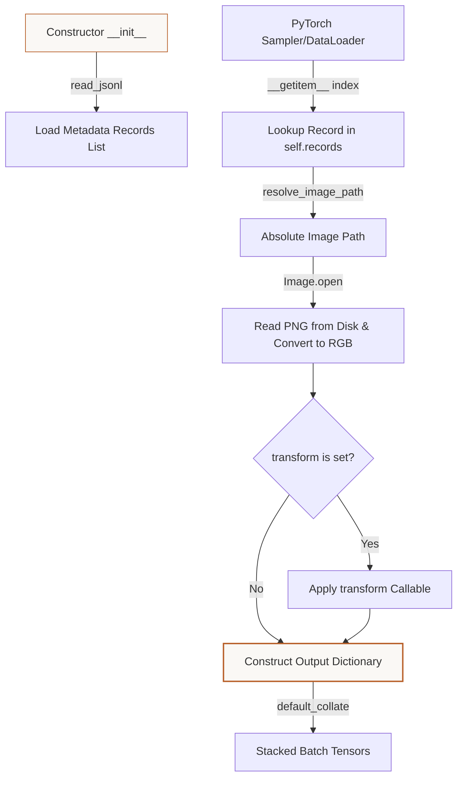

# Tutorial: The PyTorch Dataset Loader
**Files Covered:** [`litevla/data/loader.py`](file:///C:/Projects/Lite-VLA/litevla/data/loader.py)  
**Epic Milestone:** [Epic 105 / VLA-06: Dataset Generation, Labeling, and Validation]  
**Human-readable version (browser):** [`dataset-loader.html`](dataset-loader.html)

---

## 1. Goal & Objective
The goal of the dataset loader is to provide a memory-efficient PyTorch interface that loads dataset records and JPEG/PNG frames on demand, applies visual transformations, and formats them into aligned training dictionaries.

---

## 2. Why We Need It
Deep learning training loops feed on batches of image-action pairs. However, loading thousands of images into RAM during initialization will trigger Out-Of-Memory (OOM) crashes. We need a system that utilizes [lazy loading](../../concepts/pytorch_primer.md#pytorch-datasets) to read images from disk only when requested, and uses PyTorch's multi-threaded [DataLoader](../../concepts/pytorch_primer.md#pytorch-dataloaders) to pre-fetch and batch training items concurrently.

---

## 3. How to Start Thinking About It (AI Developer Thought Process)
When designing this code, I thought about the developer's sequential decision-making process:

1. **PyTorch needs an indexable interface:** "First, I thought about how PyTorch expects to retrieve training data. A standard Python generator is not indexable and cannot support random shuffling or multi-threaded prefetching. So, I decided to inherit from PyTorch's native `Dataset` class."
2. **Lazy loading to prevent crash:** "Then, I realized that if I open all dataset images in the constructor (`__init__`), the computer will run out of memory. So, I chose to load files lazily: the constructor only reads the JSONL metadata, and the actual image loading is deferred to `__getitem__` which loads a single file when PyTorch requests that index."
3. **Cross-platform path mapping:** "Next, I needed to make sure that the image file paths resolve correctly on different environments. So, I wrote a path resolution helper that translates repo-relative paths using the provided `repo_root` directory."
4. **The PIL Image collation trap:** "Finally, I realized that PyTorch's default collator crashes if it receives raw PIL Image objects. So, I decided to allow an image `transform` callable in the constructor. This allows training scripts to pass standard image transformation pipelines (like converting PIL to PyTorch tensors or NumPy arrays) before they are batched."

---

## 4. Imports & Global Constants Explained

### Imports Table

| Import Statement | What it is | Why it is used here | Concept Link |
|------------------|------------|---------------------|--------------|
| `from __future__ import annotations` | Postponed type hints | Solves self-referencing classes in type declarations. | [Annotations](../../concepts/python_primer.md#postponed-annotations) |
| `from pathlib import Path` | Path resolution utility | Resolves relative file paths into absolute locations on the host drive. | [Pathlib](../../concepts/python_primer.md#pathlib-file-resolution) |
| `from typing import Any, Callable` | Type checking utilities | Annotates transforms (`Callable`) and dictionary keys (`Any`). | [Typing](../../concepts/python_primer.md#typing-and-type-checking) |
| `from litevla.data.schema import REPO_ROOT` | Global path constant | Serves as the fallback project root directory. | N/A |
| `from litevla.data.schema import read_jsonl` | File reader generator | Reads training metadata rows line-by-line using `yield`. | [Generators](../../concepts/python_primer.md#generators-and-yield) |
| `from torch.utils.data import Dataset` | Base dataset class | Abstract class representing a collection of items. | [Datasets](../../concepts/pytorch_primer.md#pytorch-datasets) |

---

## 5. Class Data-Flow Diagrams

### `LiteVLADataset` Data Ingestion & Batch Loading Flow



---

## 6. Detailed Code Walkthrough

### Type Aliases

#### `ImageTransform`
* **Intent:** Defines the expected type signature for image preprocessing callables.
* **Implementation:**
  ```python
  ImageTransform = Callable[[Any], Any]
  ```
* **Why it's chosen:** Standardizes the type hint for parameters. It specifies a function that receives one parameter and returns one result.
* [Typing Concept Reference](../../concepts/python_primer.md#typing-and-type-checking)

---

### Custom Classes

#### `LiteVLADataset`
* **Intent:** Implements the PyTorch `Dataset` contract to feed training samples.
* **Code Snippet:**
  ```python
  class LiteVLADataset(Dataset):
      def __init__(
          self,
          jsonl_path: str | Path,
          *,
          repo_root: Path | None = None,
          transform: ImageTransform | None = None,
      ) -> None:
          self.jsonl_path = Path(jsonl_path)
          self.repo_root = repo_root or REPO_ROOT
          self.transform = transform
          self.records: list[TrainingRecord] = list(read_jsonl(self.jsonl_path))
  ```
* **Data Contract:** 
  * Inputs: mandatory path to JSONL, optional `repo_root` `Path`, optional `transform` function.
  * Outputs: A stateful dataset object containing parsed training records.
* **Why it's written this way:** Inherits from PyTorch's base `Dataset` class. The try/except block during imports ensures that if a developer runs a quick script on a machine without PyTorch installed, the file can still be imported as a plain object without crashing.
* **System Connections:** Instantiated in training starter scripts and passed directly to PyTorch's `DataLoader` class.
* [Datasets Concept Reference](../../concepts/pytorch_primer.md#pytorch-datasets)

---

### Functions in `LiteVLADataset`

#### `__len__()`
* **Intent:** Returns the total size of the dataset.
* **Data Contract:** 
  * Inputs: None.
  * Outputs: `int` total record count.
* **Why it's chosen:** Simply returns `len(self.records)`. This is called internally by PyTorch's sampler to distribute indexes.

#### `resolve_image_path(record)`
* **Intent:** Resolves relative image paths.
* **Data Contract:**
  * Inputs: `TrainingRecord` instance.
  * Outputs: absolute `Path` to the file on disk.
* **Why it's chosen:** Checks `is_absolute()` first to allow absolute paths in testing, and falls back to joining with `repo_root` if relative.

#### `__getitem__(index)`
* **Intent:** Retrieves the image and instruction at a specific index.
* **Data Contract:**
  * Inputs: `int` index.
  * Outputs: `dict[str, Any]` containing:
    * `id`: unique record ID string.
    * `image`: loaded and transformed image data.
    * `instruction`: target prompt string.
    * `action`: target movement command.
    * `source`: record source identifier.
    * `episode_id`: string episode ID.
    * `metadata`: dict of extra info.
* **Why it's chosen:** Implements lazy loading. It opens the file from disk using PIL and converts it to `"RGB"` to strip out grayscale or alpha channels. If a `transform` was provided (like NumPy array conversion), it applies it here before returning.
* **System Connections:** Called automatically by PyTorch `DataLoader` worker threads to construct training batches.

---

## 7. Practical Engineering Context

### Executive Summary
VLA-46 bridges VLA-41 processed JSONL into Epic 106 fine-tuning: **`LiteVLADataset`** is a `torch.utils.data.Dataset` that loads repo-relative RGB images with Pillow, returns instruction + Epic 103 action labels, and accepts an optional `transform` for torchvision/VLM preprocessing. The loader intentionally does not embed model-specific normalization — training scripts own the collator/transform pipeline.

### Naive Approach vs Chosen Approach
- **Naive approach**: Load all visual observations eagerly into memory during constructor initialization. Causes OOM crashes.
- **Chosen approach**: Lazy loading via index lookup in `__getitem__` combined with multi-threaded prefetching. Saves RAM and handles large files easily.

### ADR Log Summary
- **ADR (VLA-46)**: Transform callable is optional; training scripts configure tokenization and normalization algorithms themselves.

### Verification Patterns & Failure Modes
- Script check: `python scripts/smoke_dataset_loader.py --jsonl data/processed/v0.1.0/train_reviewed.jsonl`
- Verification tests: `pytest tests/test_dataset_loader.py -q`

### Related
- [dataset-validation.md](dataset-validation.md)
- [dataset-schema.md](dataset-schema.md)
- [synthetic-starter-dataset.md](synthetic-starter-dataset.md)
