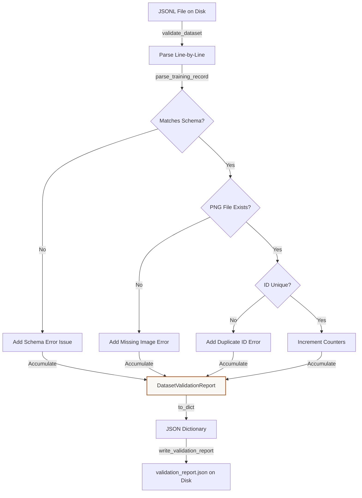

# Tutorial: Understanding Dataset Validation Checks
**Files Covered:** [`litevla/data/validator.py`](file:///C:/Projects/Lite-VLA/litevla/data/validator.py)  
**Epic Milestone:** [Epic 105 / VLA-06: Dataset Generation, Labeling, and Validation]  
**Human-readable version (browser):** [`dataset-validation.html`](dataset-validation.html)

---

## 1. Goal & Objective
The goal of the validator is to scan compiled JSONL files and ensure they are clean, structured, free of duplicates, have existing visual frames on disk, and match vocabulary constraints.

---

## 2. Why We Need It
ML pipelines are fragile. If an image path is wrong (e.g. referencing a missing PNG frame) or a steering action is malformed, standard training scripts will run for several hours before crashing mid-epoch. We need a pre-flight validator that checks all constraints, lists all errors with line numbers in a single output, warns if class category allocations are biased, and blocks release builds if errors are found.

---

## 3. How to Start Thinking About It (AI Developer Thought Process)
When designing this code, I thought about the developer's sequential decision-making process:

1. **Eager error accumulation:** "Usually, Python parsing fails fast on the first error. However, a developer wants to see *all* dataset problems in one pass instead of fixing one, running again, and hitting another error. I need to catch exceptions and collect them into a validation issues list."
2. **Verification of frames on disk:** "A record's path reference is just text. The training loop will fail if the actual PNG does not exist. The validator must check `Path.is_file()` for every record, verifying that image files are truly present on the drive."
3. **Category distribution warnings:** "If a dataset has 95% `MOVE_FORWARD` and 5% other commands, training will produce a biased model. The validator should count occurrences and flag warnings if distributions are highly unbalanced, without failing the run."

---

## 4. Imports & Global Constants Explained

### Imports Table

| Import Statement | What it is | Why it is used here | Concept Link |
|------------------|------------|---------------------|--------------|
| `from collections import Counter` | Counting helper | Computes action category totals for imbalance checks. | [Collections Counter](../../concepts/python_primer.md#collections-counter) |
| `from dataclasses import asdict, dataclass, field` | Boilerplate helper | Defines structured validation issue and report classes. | [Dataclasses](../../concepts/python_primer.md#dataclasses-and-fields) |
| `from pathlib import Path` | Path resolution utility | Resolves relative image locations across platforms. | [Pathlib](../../concepts/python_primer.md#pathlib-file-resolution) |
| `from typing import Any` | Generic type hinting | Indicates dictionary keys return signatures. | [Typing](../../concepts/python_primer.md#typing-and-type-checking) |
| `from jsonschema.exceptions import ValidationError` | Schema validator exception | Catches raw schema violations. | [JSON Schema](../../concepts/python_primer.md#json-schema-validation) |
| `from litevla.data.schema import RecordSchemaError` | Schema error class | Catches and logs schema validation errors. | N/A |

### Global Constants

#### `IMBALANCE_WARNING_RATIO`
* **What it is:** The ratio (0.50) above which a single action warning is flagged.
* **Why it is defined here:** If one command is >50% of the dataset, it warns the user of bias.

---

## 5. Class Data-Flow Diagrams

### `DatasetValidationReport` Generation & Accumulation Flow

---

## 6. Detailed Code Walkthrough

### Custom Classes

#### `ValidationIssue`
* **Intent:** Holds description details for a single schema/file failure.
* **Data Contract:** Defines `severity` (error/warning), `code`, `message`, `line`, and `record_id`.

#### `DatasetValidationReport`
* **Intent:** Holds the overall results of a validation audit.
* **Why it's chosen:** Implements a `@property` named `valid` that returns `True` only if `error_count == 0`, making validation checks easy to check.

---

### Functions in `validator.py`

#### `resolve_image_path(image_path, *, repo_root)`
* **Intent:** Resolves relative image paths.
* **Data Contract:** Inputs: path string, repo root. Outputs: absolute `Path`.

#### `validate_dataset(...)`
* **Intent:** Audits a processed JSONL file line-by-line for structural issues.
* **Data Contract:** Inputs: JSONL path, check flags. Outputs: `DatasetValidationReport`.
* **Why it's chosen:** Loops through JSONL rows. Checks path existence using `is_file()` and checks for duplicate IDs using a mapping.

#### `write_validation_report(report, output_path)`
* **Intent:** Writes the validation report to disk.

#### `format_report_summary(report)`
* **Intent:** Formats a summary screen for command-line output.

---

## 7. Practical Engineering Context

### Executive Summary
VLA-45 owns the **automated quality gate** on processed JSONL before fine-tuning and after human review (VLA-44). Unlike `read_jsonl()` which fails on the first bad row, `validate_dataset()` scans the entire file, collects every schema/filesystem problem with line numbers, and emits action/source distribution summaries with imbalance warnings. Output feeds CI, the CLI, and VLA-47 `validation_report.json` artifacts.

### Naive Approach vs Chosen Approach
- **Naive approach**: Fail-fast loading. Stops execution at the first line discrepancy, missing other issues.
- **Chosen approach**: Collect-all-errors loop returning validation issue records with line counts and warnings, making debugging easier.

### ADR Log Summary
- **ADR (VLA-45)**: Action imbalances (>50% frequency) emit policy warnings but do not flag `report.valid` as false, allowing flexible setups.

### Verification Patterns & Failure Modes
- CLI verification: `python scripts/validate_dataset.py --jsonl data/processed/v0.1.0/train_reviewed.jsonl`
- Verification tests: `pytest tests/test_dataset_validator.py -q`

### Related
- [dataset-schema.md](dataset-schema.md)
- [labeling-workflow.md](labeling-workflow.md)
- [dataset-versioning.md](dataset-versioning.md)
- [dataset-loader.md](dataset-loader.md)
