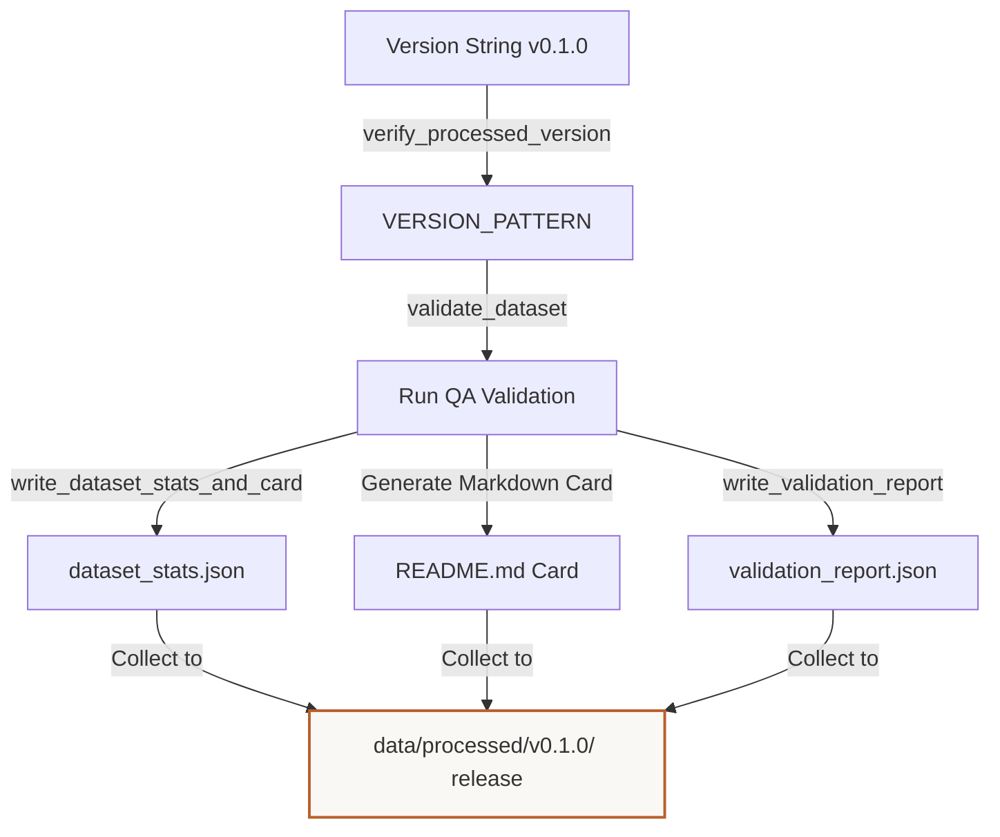

# Tutorial: Understanding Dataset Versioning & Release Packaging
**Files Covered:** [`litevla/data/versioning.py`](file:///C:/Projects/Lite-VLA/litevla/data/versioning.py)  
**Epic Milestone:** [Epic 105 / VLA-06: Dataset Generation, Labeling, and Validation]  
**Human-readable version (browser):** [`dataset-versioning.html`](dataset-versioning.html)

---

## 1. Goal & Objective
The goal of the versioning module is to formalize the release of training-ready datasets. It validates release version names (e.g. `v0.1.0`), runs quality scans across splits, and packages split JSONL files, validation reports, and a Markdown dataset card into a version-locked subdirectory under `data/processed/<version>/`.

---

## 2. Why We Need It
During model development, multiple team members fine-tune models on different snapshots of data. If training runs point to files that are continuously changing, results become impossible to compare or reproduce. We need a release gate that locks down a dataset state under a specific semantic version, calculates official statistics (split sizes, actions skew), generates a README dataset card, and guarantees that training configurations point at a static, validated dataset release.

---

## 3. How to Start Thinking About It (AI Developer Thought Process)
When designing this code, I thought about the developer's sequential decision-making process:

1. **Semantic version validation:** "If a teammate passes a messy version string like `0.1_beta`, it breaks config parsers. I need a regular expression to enforce the prefix `v` followed by standard dot-separated integers (e.g. `v0.1.0`)."
2. **Quality check before freeze:** "We cannot version a broken dataset. Before packaging, the versioner must run the full validator checks (VLA-45) across both training and validation splits, failing the release build if errors are detected."
3. **Automated documentation generation:** "Manual dataset cards drift from reality. The versioner should read live validation reports, extract statistics, and dynamically write a Hugging Face-style `README.md` dataset card containing split ratios and active labels."

---

## 4. Imports & Global Constants Explained

### Imports Table

| Import Statement | What it is | Why it is used here | Concept Link |
|------------------|------------|---------------------|--------------|
| `from __future__ import annotations` | Postponed type hints | Solves self-referencing classes in type declarations. | [Annotations](../../concepts/python_primer.md#postponed-annotations) |
| `import json` | Standard JSON utility | Writes statistic cards in JSON format. | [JSON Serialization](../../concepts/python_primer.md#json-serialization) |
| `import re` | Regular expressions parser | Verifies the release version string pattern. | [Regex](../../concepts/python_primer.md#regular-expressions) |
| `from dataclasses import asdict` | Dataclass helper | Serializes Python metadata maps into JSON. | [Dataclasses](../../concepts/python_primer.md#dataclasses-and-fields) |
| `from pathlib import Path` | Path resolution utility | Resolves relative file locations on the drive. | [Pathlib](../../concepts/python_primer.md#pathlib-file-resolution) |
| `from litevla.data.schema import read_jsonl, REPO_ROOT` | Schema import boundaries | Resolves relative locations on the drive. | N/A |
| `from litevla.data.validator import validate_dataset, write_validation_report` | Validator API | Performs validation before packaging dataset releases. | N/A |

### Global Constants

#### `VERSION_PATTERN`
* **What it is:** Regex pattern matching `v<major>.<minor>.<patch>` format strings.
* **Why it is defined here:** Enforces version string conformity.

---

## 5. Class Data-Flow Diagrams

### `VersionedRelease` Packaging Flow

---

## 6. Detailed Code Walkthrough

### Custom Classes

#### `DatasetReleaseError`
* **Intent:** Custom exception raised when version format validation or packaging checks fail.

---

### Functions in `versioning.py`

#### `verify_processed_version(version)`
* **Intent:** Validates version string format.
* **Data Contract:** Inputs: version string. Outputs: None (raises `DatasetReleaseError` if invalid).

#### `write_dataset_stats_and_card(*, jsonl_path, output_dir)`
* **Intent:** Computes statistics and writes a Hugging Face-style `README.md` dataset card.
* **Why it's chosen:** Parses the split's JSONL records, sums totals per action and source, and formats them into a clean markdown table.

#### `build_version_artifacts(*, version, train_jsonl, val_jsonl, schema_path, ...)`
* **Intent:** High-level coordinator. Creates directory, verifies version, runs validator on splits, writes reports, copy files, and generates cards.

---

## 7. Practical Engineering Context

### Executive Summary
VLA-47 packages processed releases under `data/processed/vMAJOR.MINOR.PATCH/` with machine-readable validation reports and generated `DATASET_CARD.md`. Version strings are validated before any path is constructed so typos cannot write outside the processed tree.

### Naive Approach vs Chosen Approach
- **Naive approach**: Manually copy files into folders and write README files by hand. Leads to configuration drift and documentation mismatches.
- **Chosen approach**: Automated orchestrator validating semver formats, executing QA validator checks, and dynamically generating markdown documentation from live stats.

### ADR Log Summary
- **ADR (VLA-47)**: Folder conventions must follow strict semantic versioning (`v0.1.0`), preventing vague releases like `latest` or `test` from entering training pipelines.

### Verification Patterns & Failure Modes
- CLI release command: `python scripts/validate_dataset.py --jsonl data/processed/v0.1.0/train_reviewed.jsonl --version v0.1.0 --write-artifacts`
- Verification check: `pytest tests/test_dataset_versioning.py -q`

### Related
- [dataset-validation.md](dataset-validation.md)
- [synthetic-starter-dataset.md](synthetic-starter-dataset.md)
- [dataset-schema.md](dataset-schema.md)
