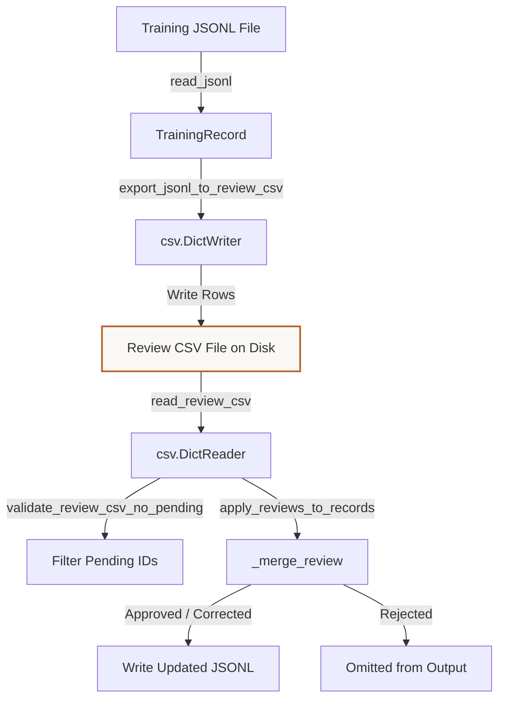

# Tutorial: Understanding the Labeling & Review CSV Workflow
**Files Covered:** [`litevla/data/label_review.py`](file:///C:/Projects/Lite-VLA/litevla/data/label_review.py)  
**Epic Milestone:** [Epic 105 / VLA-06: Dataset Generation, Labeling, and Validation]  
**Human-readable version (browser):** [`labeling-workflow.html`](labeling-workflow.html)

---

## 1. Goal & Objective
The goal of the label review module is to establish a robust spreadsheet-friendly review gate. It exports processed JSONL records into a CSV format so that human annotators can approve, correct, or reject action labels, and then safely imports those reviews back into validated JSONL training datasets.

---

## 2. Why We Need It
Robotic capture loops and automated compilers propose navigation labels, but machine guesses are sometimes wrong (e.g. steering left when facing an obstacle due to temporal delays). Hand-editing raw JSONL text files is error-prone. We need a way to present training frames and instructions to human evaluators in standard spreadsheets (like Excel or Google Sheets), track review statuses, audit adjustments, and reject incorrect records entirely so they never poison model gradients.

---

## 3. How to Start Thinking About It (AI Developer Thought Process)
When designing this code, I thought about the developer's sequential decision-making process:

1. **Human review needs spreadsheets:** "JSONL is great for machines, but human annotators cannot easily read or edit it. I need to convert records to a flat, comma-separated values (CSV) table."
2. **Stable matching key:** "When reviews are imported, we must match rows back to the original records without mistake. So, I decided that each training record must generate a unique UUID string, which is preserved as an `id` column in the spreadsheet."
3. **Strict state verification:** "We cannot allow rows to stay in an undecided state. So, I defined a strict set of review statuses (`approved`, `corrected`, `rejected`, `pending`), and raise clear errors if any row is still `pending` during the validation import."
4. **Audit blocks for logging changes:** "If a reviewer corrects a label, we must keep a history of what the original action was. Therefore, I chose to insert an audit dictionary under `metadata.review` inside the record."

---

## 4. Imports & Global Constants Explained

### Imports Table

| Import Statement | What it is | Why it is used here | Concept Link |
|------------------|------------|---------------------|--------------|
| `from __future__ import annotations` | Postponed type hints | Solves self-referencing classes in type declarations. | [Annotations](../../concepts/python_primer.md#postponed-annotations) |
| `import csv` | Python CSV module | Handles reading and writing delimited spreadsheet files. | [JSON/CSV Serialization](../../concepts/python_primer.md#json-serialization) |
| `from dataclasses import dataclass` | Boilerplate helper | Defines clean structured representations for reviews. | [Dataclasses](../../concepts/python_primer.md#dataclasses-and-fields) |
| `from datetime import datetime, timezone` | Time formatting tools | Formats UTC timestamps for review entries. | [Timezones](../../concepts/python_primer.md#timezones--utc-datetime) |
| `from pathlib import Path` | Path resolution utility | Resolves relative file locations on the drive. | [Pathlib](../../concepts/python_primer.md#pathlib-file-resolution) |
| `from typing import Any, Iterator` | Type annotation tools | Declares variable annotations. | [Typing](../../concepts/python_primer.md#typing-and-type-checking) |
| `from litevla.actions import parse_action` | Action word validator | Converts string actions to verified steering commands. | N/A |

### Global Constants

#### `REVIEW_COLUMNS`
* **What it is:** Defines the fixed list of spreadsheet column names.
* **Why it is defined here:** Enforces key consistency between CSV writers and readers.

#### `REVIEW_STATUSES`
* **What it is:** The set of allowed review status values (`pending`, `approved`, `corrected`, `rejected`).

---

## 5. Class Data-Flow Diagrams

### `ReviewRow` CSV Data Lifecycle

---

## 6. Detailed Code Walkthrough

### Custom Classes

#### `ReviewRow`
* **Intent:** Represents a single review row parsed from a CSV file.
* **Why it's written this way:** Validates that the action string exists in the system steering vocabulary if the status is marked as `corrected`.

#### `ImportReviewStats`
* **Intent:** Accumulates counts during the import process (`approved`, `corrected`, `rejected`, `pending_skipped`, `output_rows`).

---

### Functions in `label_review.py`

#### `export_jsonl_to_review_csv(jsonl_path, csv_path)`
* **Intent:** Reads a processed JSONL file and exports its records to a review spreadsheet.
* **Why it's chosen:** Uses `csv.DictWriter` to guarantee correct column alignment and automatically escape commas.
* [CSV Parsing Concept Reference](../../concepts/python_primer.md#csv-parsing)

#### `read_review_csv(csv_path)`
* **Intent:** Reads and parses the review CSV file into `ReviewRow` records.
* **Why it's chosen:** Performs structural checking, throwing a descriptive `LabelReviewError` if header columns are missing.
* [CSV Parsing Concept Reference](../../concepts/python_primer.md#csv-parsing)

#### `_merge_review(record, row)`
* **Intent:** Merges a human decision back into a training record.
* **Why it's chosen:** If corrected, updates the action label and logs the modification history (original label, reviewer name, timestamp) under `metadata.review`.

#### `apply_reviews_to_records(records, reviews)`
* **Intent:** Aggregates a list of records and applies their corresponding reviews, matching on `id`. Rejected records are omitted from the output.

#### `validate_review_csv_no_pending(csv_path, *, jsonl_path)`
* **Intent:** Scans the review file and flags an error if any record is still marked as `pending`.

#### `bulk_approve_review_csv(csv_path, *, reviewer, notes)`
* **Intent:** Automation helper that updates all `pending` rows in a CSV to `approved`, speeding up release packaging.

#### `import_review_csv_to_jsonl(*, jsonl_path, csv_path, output_path)`
* **Intent:** High-level compiler interface. Merges reviews back onto processed datasets and outputs the finalized training file.

---

## 7. Practical Engineering Context

### Executive Summary
VLA-44 owns the **human review path** between VLA-43 processed JSONL and training-ready data. Reviewers work in a spreadsheet-friendly CSV (`data/templates/label_review.csv`), not in JSONL directly. Export → edit → import preserves traceability via `id`, `review_status`, and `metadata.review` on merged rows. Approved and corrected rows become `source: manual_review`; rejected rows are dropped from the import output.

### Naive Approach vs Chosen Approach
- **Naive approach**: Hand-edit JSONL strings directly. Too slow and results in schema typos.
- **Chosen approach**: Export to a flat CSV structure with stable UUID matching keys. Validates steering actions during import.

### ADR Log Summary
- **ADR (VLA-44)**: CSV format is strictly for human review; JSONL remains the canonical machine format for the PyTorch loader.

### Verification Patterns & Failure Modes
- Export command: `python scripts/label_review.py export --jsonl data/processed/v0.1.0/train.jsonl --output data/processed/v0.1.0/label_review.csv`
- Import command: `python scripts/label_review.py import --jsonl data/processed/v0.1.0/train.jsonl --csv data/processed/v0.1.0/label_review.csv --output data/processed/v0.1.0/train_reviewed.jsonl`
- Verification check: `pytest tests/test_label_review.py -q`

### Related
- [dataset-schema.md](dataset-schema.md)
- [synthetic-starter-dataset.md](synthetic-starter-dataset.md)
- [dataset-validation.md](dataset-validation.md)
- [dataset-versioning.md](dataset-versioning.md)
