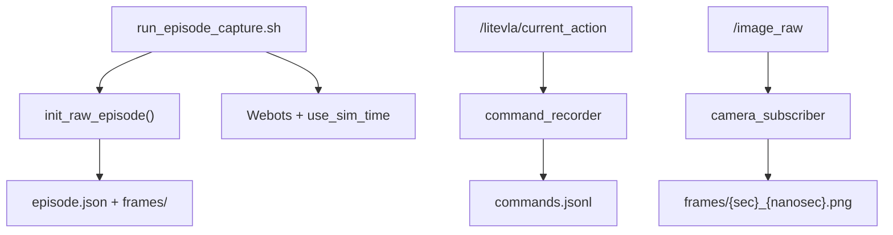

# Simulation data capture tool

**Epic:** Dataset Generation, Labeling, and Validation (105) · **Jira epic:** VLA-6 · **Story:** VLA-42 / 1030 · **Subtasks:** 10090 (frame recorder), 10091 (command labels), 10092 (episode metadata)

**Human-readable version (browser):** [`simulation-data-capture.html`](simulation-data-capture.html)

## Executive summary

VLA-42 owns **Layer A raw capture** during Webots keyboard teleop: each session writes a self-contained directory under `data/raw/episodes/<episode_id>/` with `episode.json`, sim-stamped `commands.jsonl`, and `frames/*.png`. VLA-43 joins frames to commands and emits VLA-41 training JSONL. Capture reuses Epic 102 teleop nodes; the entry point is `run_episode_capture.sh` (interactive TTY required).

## Mental model

Think of raw capture as a **flight recorder**, not a training set.

It exists because sim time, camera frames, and discrete action transitions happen at different rates — you need a durable log that preserves *when* each observation happened and *what* the operator last commanded.

The key engineering tension is **fidelity vs volume**: commands log on action transitions (~few Hz) while frames arrive at ~5 Hz; the builder must join them later without guessing.

A beginner mistake is running plain `run_teleop_sim.sh` and expecting `data/raw/episodes/` to populate, or assuming every frame gets a fresh label.

A senior engineer watches for **sim-time consistency** — every recorder must use `use_sim_time:=true` and stamp rows with simulation clock, not wall clock.

## Backstory: why this exists

Before structured capture, teleop wrote lightweight logs under `outputs/teleop/` without episode metadata or a stable join key to camera frames. The naive solution would be “save a screenshot whenever I press a key.”

That breaks because key events and camera frames are not synchronized, filenames would not align with `commands.jsonl`, and crashed sessions would leave no record of intent.

So this design chooses **episode directories created before ROS starts**, with shared sim-stamp naming for frames and command rows. The pattern matches robotics dataset practices: raw multimodal logs first, curated training rows second.

## Prerequisites

- Epic 102 manual teleop: [`manual-teleoperation.md`](../ros-2-simulation-and-robot-control-skeleton/manual-teleoperation.md)
- ROS 2 sim time and `/clock` in Webots

## Vocabulary

| Term | Meaning in this project |
|------|-------------------------|
| **Episode** | One capture session folder under `data/raw/episodes/<episode_id>/` |
| **`episode.json`** | Instruction, world, source, frame rate — written before ROS launch |
| **`commands.jsonl`** | Append-only log of action transitions with sim stamps |
| **Sim stamp** | `{sim_sec}_{sim_nanosec}` shared by frames and command rows |
| **`command_recorder`** | ROS node that logs `/litevla/current_action` changes |
| **`camera_subscriber`** | ROS node that saves `/image_raw` to `frames/` at ~5 Hz |

## Guided code reading

1. `litevla/data/episode.py` — `init_raw_episode()`, `frame_filename()`; pure Python, no ROS.
2. `data/schema/episode.schema.json` — metadata contract for `episode.json`.
3. `ros_ws/src/litevla_bridge/litevla_bridge/capture_utils.py` — `build_command_record()`.
4. `ros_ws/src/litevla_bridge/litevla_bridge/command_recorder.py` — `episode_dir` parameter.
5. `ros_ws/scripts/run_episode_capture.sh` — orchestration order (metadata first, then nodes).

While reading, ask: Who writes first? What triggers a command row? What names frames?

## API contract and data flow



| Contract | Rule |
|----------|------|
| Episode init | `episode.json` written **before** ROS nodes start |
| Frame naming | `{sim_sec}_{sim_nanosec:09d}.png` from image header stamp |
| Command log | Append on **action transition**; includes `sim_stamp_sec/nanosec` |
| Sim clock | All recorders use `use_sim_time:=true` |
| Entry point | `./ros_ws/scripts/run_episode_capture.sh` — not plain `run_teleop_sim.sh` |

### Naive approach vs chosen approach

| Approach | Why it seems attractive | Why we did or did not choose it |
|----------|-------------------------|----------------------------------|
| Log every twist tick | “More data” | Floods JSONL; labels duplicate same action |
| Wall-clock filenames | Simple | Breaks sim replay and VLA-43 join |
| Reuse casual teleop script | One script | Mixes debug logs with dataset capture |
| Dedicated capture script + episode dir | Extra step | Clear opt-in dataset sessions with metadata |

## Implementation breakdown

### Episode layout — metadata before motion

**Snippet** (`litevla/data/episode.py`):

```python
def init_raw_episode(*, instruction: str, source: str = "teleop", world: str = "mvp_arena.wbt", ...) -> Path:
    episode_dir = root / eid
    frames_dir = episode_dir / "frames"
    frames_dir.mkdir(parents=True, exist_ok=True)
    meta = EpisodeMetadata(episode_id=eid, instruction=instruction, ...)
    write_episode_json(episode_dir, meta)
    return episode_dir
```

**What to notice:** `EpisodeMetadata` is validated against `episode.schema.json` before any PNG exists.

**Why it is written this way:** Crashed sim still leaves session intent and join parameters on disk.

**Risks and gotchas:** `episode_id` defaults to UTC timestamp — do not rename folders after capture without updating references.

---

### Command rows — transition-triggered logging

**Snippet** (`capture_utils.py` pattern):

```python
def build_command_record(*, stamp, sim_stamp_sec, sim_stamp_nanosec, source, action, linear_x, angular_z):
    ...
```

When `episode_dir` is set on `command_recorder`, rows append to `commands.jsonl` in the episode folder (not `outputs/teleop/`).

**Risks and gotchas:** Many consecutive frames may share one label until the operator changes action — VLA-43 forward-fills by design.

---

### Frame recorder — rate-limited sim-stamped PNGs

`camera_subscriber` with `record_frames:=true`, `frame_save_dir:=${EPISODE_DIR}/frames`, `record_interval_sec:=0.2` (~5 Hz).

**Risks and gotchas:** Rate limit uses wall-clock interval; filename still uses **sim stamp** from the image message — that stamp is the join key.

## Engineering decisions

```text
ADR: Sim-time alignment (10090)
Status: Accepted
Decision: Reuse camera_subscriber filename convention; command rows add matching sim stamp fields.
Consequences: VLA-43 forward-fills without a separate index file.
```

```text
ADR: Episode metadata before ROS (10092)
Status: Accepted
Decision: Shell/Python writes episode.json first; recorders only append runtime artifacts.
Consequences: Partial sessions remain interpretable.
```

## Verification patterns and failure modes

```bash
pytest tests/test_episode_capture.py -q
pytest ros_ws/src/litevla_bridge/test/test_capture_utils.py -q

# Manual smoke (interactive terminal + Webots)
./ros_ws/scripts/run_episode_capture.sh --instruction "Move toward the red cube."
./ros_ws/scripts/stop_teleop_sim.sh
ls data/raw/episodes/<latest>/
```

| Symptom | Likely cause | Investigation | Fix |
|---------|--------------|---------------|-----|
| Empty `frames/` | `record_frames` false or wrong dir | Check launch params | Re-run with `run_episode_capture.sh` |
| No `commands.jsonl` | `episode_dir` not passed | Inspect recorder params | Use capture script, not casual teleop |
| Frame/command times don't join | `use_sim_time` false | `ros2 param get` / clock topic | Enable sim time on all nodes |
| Script exits immediately | No TTY | Run in interactive terminal | SSH with `-t` or local terminal |

## Engineering principle taught by this task

**Separate capture fidelity from training curation.** Raw logs should be complete and timestamped; narrowing to SFT rows is a downstream compiler problem (VLA-43), not something the teleop operator should solve live.

## Active learning checks

1. Why log commands on action **transitions** instead of every heartbeat tick?
2. What file proves session intent if Webots crashes before any frame saves?
3. Why must frame filenames use sim time, not wall time?
4. How would you verify a new episode is joinable before running the builder?

## Open questions

- **Dummy/scripted capture:** `episode.json` `source` enum includes `dummy` and `scripted`; wiring a dummy-driven capture session reuses the same layout (future work).

## Related

- [manual-teleoperation.md](../ros-2-simulation-and-robot-control-skeleton/manual-teleoperation.md) (Epic 102 teleop stack)
- [dataset-schema.md](dataset-schema.md) (VLA-41 processed contract)
- [synthetic-starter-dataset.md](synthetic-starter-dataset.md) (VLA-43 consumes raw episodes)
- [`data/schema/episode.schema.json`](../../../../data/schema/episode.schema.json)
