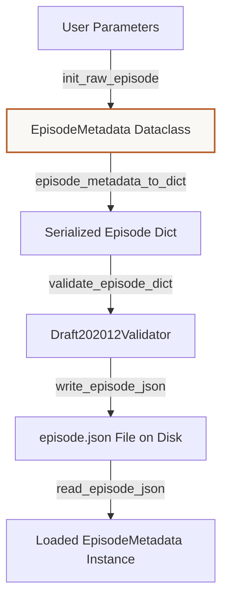

# Tutorial: Understanding Lite-VLA Simulator Data Capture
**Files Covered:** [`litevla/data/episode.py`](file:///C:/Projects/Lite-VLA/litevla/data/episode.py)  
**Epic Milestone:** [Epic 105 / VLA-06: Dataset Generation, Labeling, and Validation]  
**Human-readable version (browser):** [`simulation-data-capture.html`](simulation-data-capture.html)

---

## 1. Goal & Objective
The goal of the episode module is to provide a standardized directory structure and serialization protocol to capture raw Webots keyboard teleoperation runs under `data/raw/episodes/<episode_id>/`.

---

## 2. Why We Need It
Different elements of the simulator operate at different frequencies (camera feeds, user keypress commands, clock loops). Storing training records directly during a simulation run runs the risk of drops or desynchronizations if Webots lags. We need a "flight recorder" system that records raw timestamps and frames into a durable layout, allowing a compiler node (VLA-43) to align them offline without guessing.

---

## 3. How to Start Thinking About It (AI Developer Thought Process)
When designing this code, I thought about the developer's sequential decision-making process:

1. **Pre-flight metadata recording:** "First, we must write metadata (instruction, world configuration, started_at) *before* the run starts. If the simulator crashes halfway, we need to know the session's original intent, so writing `episode.json` is our pre-flight check."
2. **Padded frame naming:** "Then, I needed a clean system to name visual camera observations. Using padded simulation clock timestamps (like `12_340000000.png`) guarantees that string-sorted files match simulation chronological time, preventing timestamp drifts."
3. **Sim-time join keys:** "Finally, operator commands must be logged with matching simulation clock stamps instead of host CPU clock stamps, ensuring VLA-43 can align them correctly regardless of simulation execution speed."

---

## 4. Imports & Global Constants Explained

### Imports Table

| Import Statement | What it is | Why it is used here | Concept Link |
|------------------|------------|---------------------|--------------|
| `from __future__ import annotations` | Postponed type hints | Solves self-referencing classes in type hints. | [Annotations](../../concepts/python_primer.md#postponed-annotations) |
| `import json` | Standard JSON parser | Used to read and write raw JSON/JSONL rows. | [JSON Serialization](../../concepts/python_primer.md#json-serialization) |
| `from dataclasses import dataclass` | Boilerplate helper | Defines the structured, read-only data structures for episodes. | [Dataclasses](../../concepts/python_primer.md#dataclasses-and-fields) |
| `from datetime import datetime, timezone` | Time formatting tools | Formats UTC timestamps for raw episodes. | [Timezones](../../concepts/python_primer.md#timezones--utc-datetime) |
| `from pathlib import Path` | Cross-platform file paths | Handles directory paths, resolving slashes correctly on Windows and Linux. | [Pathlib](../../concepts/python_primer.md#pathlib-file-resolution) |
| `from typing import Any` | Generic type hinting | Indicates key-value dictionary returns. | [Typing](../../concepts/python_primer.md#typing-and-type-checking) |
| `import jsonschema` | Draft schema validator | Checks that incoming dictionaries contain all mandatory variables. | [JSON Schema](../../concepts/python_primer.md#json-schema-validation) |

### Global Constants

#### `REPO_ROOT`
* **What it is:** Resolves the absolute parent directory of the active Lite-VLA repository.
* [Pathlib Concept Reference](../../concepts/python_primer.md#pathlib-file-resolution)

#### `EPISODE_SCHEMA_PATH`
* **What it is:** Absolute path to the JSON Schema contract for simulator episodes.

#### `DEFAULT_RAW_EPISODES_DIR`
* **What it is:** The default directory where simulator records are saved (`data/raw/episodes`).

---

## 5. Class Data-Flow Diagrams

### `EpisodeMetadata` Generation & Loading Flow



---

## 6. Detailed Code Walkthrough

### Custom Classes

#### `EpisodeMetadata`
* **Intent:** Represents the metadata description for a raw simulator run.
* **Code Snippet:**
  ```python
  @dataclass(frozen=True)
  class EpisodeMetadata:
      episode_id: str
      instruction: str
      source: str
      world: str
      started_at: str
      record_frames_hz: float
      schema_version: str = "1"
      notes: str | None = None
  ```
* **Data Contract:** Holds simulator parameters (`episode_id`, `instruction`, `source`, `world`, `started_at`, `record_frames_hz`, `notes`).
* **Why it's written this way:** Ensures all simulator runs record the world configuration and frame rate identically.
* **System Connections:** Written to `episode.json` inside the simulator directory.

#### `EpisodeSchemaError`
* **Intent:** Custom exception raised when validation fails.
* **Why it's written this way:** Inherits from `ValueError`. This allows training scripts to catch and handle schema validation errors specifically.
* [Custom Exceptions Concept Reference](../../concepts/python_primer.md#custom-exceptions)

---

### Functions in `episode.py`

#### `episode_schema_path()`
* **Intent:** Computes the path to the episode schema file.

#### `load_episode_schema()`
* **Intent:** Reads the episode schema file from disk.

#### `new_episode_id(when)`
* **Intent:** Generates a UTC directory-safe episode ID.
* **Data Contract:** Inputs: optional `datetime`. Outputs: `str` ID (e.g. `20260705T200000Z`).

#### `validate_episode_dict(raw, *, schema)`
* **Intent:** Validates simulator episode metadata.
* **Data Contract:** Inputs: raw dict, optional schema. Outputs: None.

#### `episode_metadata_to_dict(meta)`
* **Intent:** Converts `EpisodeMetadata` to a dictionary.

#### `write_episode_json(episode_dir, meta)`
* **Intent:** Writes `episode.json` file inside the episode directory.
* **Data Contract:** Inputs: target directory `Path`, `EpisodeMetadata`. Outputs: `Path` to the saved file.

#### `init_raw_episode(...)`
* **Intent:** Sets up a new episode folder on disk with `episode.json` and a `frames/` subdirectory.
* **Data Contract:** Inputs: optional base directory, instruction text, source name, world name, recording frequency, optional episode ID, notes. Outputs: `Path` to the created episode directory.
* **Why it's chosen:** Standardizes folder creation. Ensures the folder and its `frames` directory exist using `mkdir(parents=True, exist_ok=True)`.

#### `frame_filename(sim_stamp_sec, sim_stamp_nanosec)`
* **Intent:** Generates a padded PNG frame filename (e.g. `12_340000000.png`).
* **Data Contract:** Inputs: seconds `int`, nanoseconds `int`. Outputs: `str` filename.
* **Why it's chosen:** Uses `:09d` to pad nanoseconds with zeros, ensuring files are ordered correctly.

#### `read_episode_json(episode_dir)`
* **Intent:** Reads and validates `episode.json` from a directory.
* **Data Contract:** Inputs: directory path. Outputs: `EpisodeMetadata`.

---

## 7. Practical Engineering Context

### Executive Summary
VLA-42 owns **Layer A raw capture** during Webots keyboard teleop: each session writes a self-contained directory under `data/raw/episodes/<episode_id>/` with `episode.json`, sim-stamped `commands.jsonl`, and `frames/*.png`. VLA-43 joins frames to commands and emits VLA-41 training JSONL. Capture reuses Epic 102 teleop nodes; the entry point is `run_episode_capture.sh` (interactive TTY required).

### API Contract & Data Flow
```text
Keyboard Input ──> /litevla/current_action ──> commands.jsonl
Camera Feed    ──> /image_raw              ──> frames/{sec}_{nanosec}.png
Start params   ──> episode.json (durable metadata folder descriptor)
```

### Naive Approach vs Chosen Approach
- **Naive approach**: Store screenshot frames when keys are pressed. Breaks due to desynchronization and lack of session context.
- **Chosen approach**: Split logging under UTC run subdirectories. Pre-flight JSON metadata plus padded frame names using simulation clock timestamps.

### ADR Log Summary
- **ADR (VLA-42)**: Time stamps are tied strictly to ROS simulation time instead of localized host wall-clock time, allowing offline interpolation.

### Verification Patterns & Failure Modes
- CLI tool check: `./ros_ws/scripts/run_episode_capture.sh`
- Common error: Empty `frames/` or missing `commands.jsonl` due to running in non-interactive / non-TTY terminals. Ensure ROS execution maps coordinates correctly.

### Related
- [manual-teleoperation.md](../ros-2-simulation-and-robot-control-skeleton/manual-teleoperation.md)
- [dataset-schema.md](dataset-schema.md)
- [synthetic-starter-dataset.md](synthetic-starter-dataset.md)
