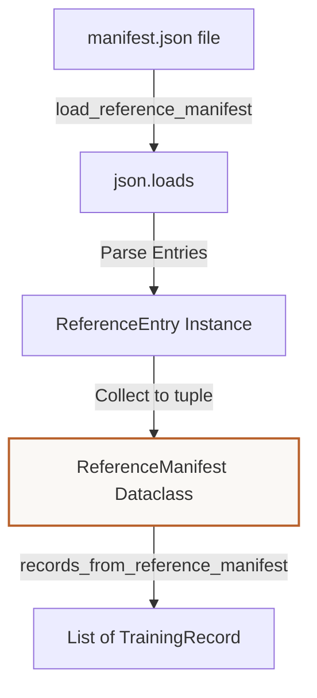

# Tutorial: Understanding the Synthetic Starter Dataset Builder
**Files Covered:** [`litevla/data/builder.py`](file:///C:/Projects/Lite-VLA/litevla/data/builder.py)  
**Epic Milestone:** [Epic 105 / VLA-06: Dataset Generation, Labeling, and Validation]  
**Human-readable version (browser):** [`synthetic-starter-dataset.html`](synthetic-starter-dataset.html)

---

## 1. Goal & Objective
The goal of the builder is to compile raw Webots episodes and reference photos into a balanced, augmented, and reproducible starter dataset containing ≥200 train/val training records.

---

## 2. Why We Need It
Training machine learning models on a very small set of demonstration images will cause the model to overfit. However, capturing hundreds of manual episodes is tedious and slow. We need a compiler that takes high-quality reference observations, applies photometric visual changes (brightness, contrast, Gaussian blur, sharping) to generate diverse variants, shuffles them deterministically, and partitions them into clean training and validation splits.

---

## 3. How to Start Thinking About It (AI Developer Thought Process)
When designing this code, I thought about the developer's sequential decision-making process:

1. **Deterministic splits are a must:** "If we use standard random shuffling, splits will change every time we build the dataset, which destroys model test repeatability. Therefore, split selection must use local, seed-locked generators."
2. **Offline alignment semantics:** "Raw logs capture frames and user inputs independently. To compile training rows, I need to align frames to commands. Using forward-fill logic (matching a frame to the active command at its timestamp) is the correct alignment choice."
3. **Capping variance to prevent dominance:** "If a single reference image has 100 variants, it will skew action weights. Capping variants per reference image ensures we balance action counts across all steering tokens."

---

## 4. Imports & Global Constants Explained

### Imports Table

| Import Statement | What it is | Why it is used here | Concept Link |
|------------------|------------|---------------------|--------------|
| `import hashlib` | Hash digest builder | Generates unique hashes to seed local random generators. | [Hashlib](../../concepts/python_primer.md#hashing-with-hashlib) |
| `import json` | Standard JSON utility | Reads JSON files (like the reference image manifest). | [JSON](../../concepts/python_primer.md#json-serialization) |
| `import random` | Random number generator | Shuffles the records list and creates variations. | [Randomness](../../concepts/python_primer.md#deterministic-randomness) |
| `import re` | Regular expressions parser | Extracts sim stamp values from frame filenames. | [Regex](../../concepts/python_primer.md#regular-expressions) |
| `from pathlib import Path` | Path resolution utility | Resolves relative image locations across platforms. | [Pathlib](../../concepts/python_primer.md#pathlib-file-resolution) |
| `from PIL import Image` | Python Imaging Library | Opens and saves visual frames. | N/A |
| `from PIL import ImageEnhance, ImageFilter` | Image filter enhancers | Alters brightness, contrast, sharping, and blurs. | N/A |
| `import numpy as np` | Multi-dimensional arrays | Performs visual matrix adjustments and noise overlays. | N/A |
| `from litevla.data.schema import TrainingRecord` | Dataclass definition | Creates type-safe records for the output files. | [Dataclasses](../../concepts/python_primer.md#dataclasses-and-fields) |

### Global Constants

#### `DEFAULT_MAX_VARIANTS_PER_IMAGE`
* **What it is:** Limits the number of augmented variations generated per reference image (capped at 25).
* **Why it is defined here:** Prevents a single image from dominating the dataset.

#### `FRAME_STAMP_RE`
* **What it is:** Regex pattern checking that frame names match the form `<seconds>_<nanoseconds>.png`.
* [Regex Concept Reference](../../concepts/python_primer.md#regular-expressions)

---

## 5. Class Data-Flow Diagrams

### ReferenceManifest Ingestion & Build Flow

---

## 6. Detailed Code Walkthrough

### Custom Classes

#### `ReferenceEntry`
* **Intent:** Represents a single reference photo row description.
* **Data Contract:** Holds `filename`, `instruction`, and `action` strings.

#### `ReferenceManifest`
* **Intent:** Holds an episode ID, world descriptor, and a list of `ReferenceEntry` records.

#### `BuildStats`
* **Intent:** Accumulates record count diagnostics during dataset compilation.

#### `BuildResult`
* **Intent:** Holds final build outputs (train path, validation path, splits counts, and stats).

---

### Functions in `builder.py`

#### `repo_relative(path, *, repo_root)`
* **Intent:** Translates an absolute system path into a POSIX repo-relative string using forward slashes.
* **Data Contract:** Inputs: absolute `Path`, optional `repo_root`. Outputs: `str` relative path.
* **Why it's chosen:** Using relative paths guarantees that the dataset compiles and runs on any developer's machine.

#### `parse_frame_stamp(filename)`
* **Intent:** Extracts simulation seconds and nanoseconds from a frame name.
* **Data Contract:** Inputs: `str` filename. Outputs: `tuple[int, int] | None`.
* **Why it's chosen:** Uses `FRAME_STAMP_RE` to match and extract numeric values using regex capture groups.

#### `sim_stamp_to_ns(sim_sec, sim_nanosec)`
* **Intent:** Converts seconds and nanoseconds into total nanoseconds.

#### `load_reference_manifest(path)`
* **Intent:** Reads and parses the reference image configuration JSON file.
* **Data Contract:** Inputs: manifest path. Outputs: `ReferenceManifest`.

#### `read_raw_commands(path)`
* **Intent:** Reads raw JSONL commands.
* **Data Contract:** Inputs: directory `Path`. Outputs: `list[dict]` sorted by time.
* **Why it's chosen:** Uses `sorted` with a lambda to order commands chronologically, ensuring correct timestamp matching.
* [Sorting Concept Reference](../../concepts/python_primer.md#sorting-and-lambdas)

#### `_action_at_sim_time(commands, sim_ns)`
* **Intent:** Pairs each camera frame with the latest command that occurred at or before the frame was taken.
* **Data Contract:** Inputs: commands sequence, simulation time. Outputs: matched command dict.

#### `records_from_raw_episode(episode_dir)`
* **Intent:** Compiles and labels raw simulation runs.
* **Data Contract:** Inputs: episode path. Outputs: list of records.

#### `_augmentation_rng(seed, stem, variant)`
* **Intent:** Creates a local random generator that is unique to each image and variant.
* **Data Contract:** Inputs: seed int, image stem string, variant index. Outputs: local `random.Random` instance.
* **Why it's chosen:** Uses SHA-256 to hash the image properties together, ensuring that each variant uses a unique seed.
* [Deterministic Randomness Concept Reference](../../concepts/python_primer.md#deterministic-randomness)

#### `_apply_augmentation(image, variant, rng)`
* **Intent:** Applies visual changes to an image to simulate diverse real-world lighting.
* **Data Contract:** Inputs: PIL `Image`, variant count, local `random.Random` generator. Outputs: Augmented PIL `Image`.
* **Why it's chosen:** Brightness, contrast, and scaling parameters are randomly selected using `rng.uniform`. Adds Gaussian noise to arrays using NumPy.
* [Pathlib Concept Reference](../../concepts/python_primer.md#pathlib-file-resolution)

#### `split_records(records, *, val_ratio, seed)`
* **Intent:** Shuffles and partitions data into train/val sets.
* **Data Contract:** Inputs: records, float ratio, seed. Outputs: train list, val list.
* **Why it's chosen:** Shuffles using a local random instance to ensure reproducibility.

#### `build_starter_dataset(...)`
* **Intent:** The main compiler function. Combines raw runs and reference photos, applies augmentations, verifies schemas, splits files, and writes the output files.
* **Data Contract:** Inputs: version code, threshold counts, ratios, seeds. Outputs: `BuildResult`.

---

## 7. Practical Engineering Context

### Executive Summary
VLA-43 implements the **Layer A → Layer B compiler**: it ingests reference Webots frames, optional VLA-42 raw episodes, and Pillow augmentations to produce ≥200 validated `TrainingRecord` rows under `data/processed/<version>/train.jsonl` and `val.jsonl`. Every row passes VLA-41 schema validation before write. The CLI is `scripts/build_starter_dataset.py`.

### Naive Approach vs Chosen Approach
- **Naive approach**: Single massive file checkouts or raw random splitting. Breaks because split distributions change.
- **Chosen approach**: Seed-locked local generators coupled with deterministic variant limits. Keeps train/val partitions stable across builds.

### ADR Log Summary
- **ADR (VLA-43)**: Augmentation cap per reference image is set to 25. If multiple reference frames are present, it auto-scales to fulfill the `--min-records` requirement.

### Verification Patterns & Failure Modes
- CLI command to compile: `python scripts/build_starter_dataset.py --write-artifacts`
- Verification check: `pytest tests/test_dataset_builder.py -q`

### Related
- [dataset-schema.md](dataset-schema.md)
- [simulation-data-capture.md](simulation-data-capture.md)
- [dataset-validation.md](dataset-validation.md)
- [dataset-versioning.md](dataset-versioning.md)
