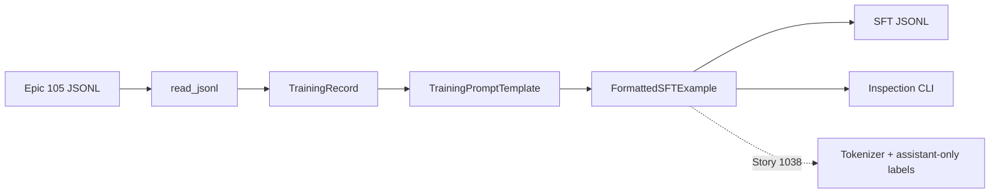

# Prepare model training format — architecture

**Epic:** Supervised Fine-Tuning and Model Evaluation (106) · **Jira:** Story 1036, subtasks 10108–10110 · **Status:** Complete (verified locally)

**Human-readable version (browser):** [`prepare-model-training-format.html`](prepare-model-training-format.html)

**Code walkthrough:** [`../code/prepare-model-training-format.md`](../code/prepare-model-training-format.md)

## Executive summary

Story 1036 creates the boundary between Epic 105's model-neutral training records and the model-specific supervised fine-tuning (SFT) representation consumed by later training stories. It guarantees that every example has a visual placeholder, the same prompt shape used by inference, one validated discrete action target, and an explicit split between prompt tokens and target tokens.

The implementation deliberately does not tokenize examples or calculate loss masks yet. It records the masking contract—prompt tokens are ignored and action tokens are supervised—so Story 1038 can implement the processor-aware collator without changing this data contract.

## Mental model

Think of this feature as a **shipping adapter between two warehouses**. Epic 105 packages a validated observation as an image path, instruction, and action. The VLM training stack needs the same contents repacked as a conversation: `USER: <image> ... ASSISTANT:` followed by the expected action.

It exists because storage format and training format solve different problems. JSONL records should remain model-neutral and auditable, while prompts must match the selected model and inference runtime.

The key engineering tension is **model specificity without duplicating runtime behavior**. Training needs a model-facing conversation format, but defining a second independent prompt would allow training and inference to drift.

A beginner mistake is concatenating the action directly into one opaque text field and later asking the trainer to guess which tokens should contribute to loss.

A senior engineer watches for three forms of drift: prompt-version drift between training and inference, action-vocabulary drift between data and runtime, and masking drift where user/system tokens accidentally become supervised labels.

## Backstory: why this exists

Before this story, `LiteVLADataset` could load validated images, instructions, and actions, but no component expressed how those values should appear to a VLM during supervised training.

The naive solution would be to generate an arbitrary string such as `"<image> Move toward the cube => MOVE_FORWARD"` inside the training loop. That breaks because the baseline inference path uses `PromptFormatter`, not that ad-hoc syntax. The model would learn one conversation boundary during training and receive another at runtime. Keeping prompt and target in one undifferentiated field also makes assistant-only loss masking fragile.

This design therefore reuses `litevla.prompting.PromptFormatter`, validates labels against the shared action vocabulary, and emits three explicit fields:

- `prompt`: user/system context ending at `ASSISTANT:`
- `target`: one exact action token
- `full_text`: the concatenation used for tokenization

This is the same separation commonly used in instruction-tuning pipelines: storage remains task-oriented, formatting is model-oriented, and tokenization/masking remains processor-oriented.

## Prerequisites

Before reading this task, understand these upstream contracts:

- **Epic 103 action vocabulary** — `ACTION_NAMES` and `is_valid_action` define the five exact labels accepted by training. See [`../../action-interface-parser-and-safety-layer/action-schema.md`](../../action-interface-parser-and-safety-layer/action-schema.md).
- **Epic 104 inference prompting** — `PromptFormatter` owns the runtime `USER: <image> ... ASSISTANT:` shape. See [`../../baseline-vision-language-inference-prototype/prompting-strategy.md`](../../baseline-vision-language-inference-prototype/prompting-strategy.md).
- **Epic 105 record validation** — `read_jsonl` validates persisted JSONL and returns `TrainingRecord`. A directly constructed dataclass does not rerun JSON Schema validation.
- **JSONL** — each line is one independent JSON object; conversion preserves this one-example-per-line structure.
- **Causal language-model labels** — token labels select which positions contribute to loss; Story 1038 will create them after model-specific tokenization.

## Vocabulary

| Term | Meaning in this task |
|------|----------------------|
| SFT | Supervised fine-tuning: updating a model using examples with known desired outputs. |
| `TrainingRecord` | Epic 105 dataclass containing an image path, instruction, action, and audit metadata. |
| Prompt | Input context shown to the model; here it ends at `ASSISTANT:` without the answer. |
| Target | Exact discrete action the model should learn to generate. |
| `full_text` | Prompt and target joined into one string for later tokenization. |
| `<image>` | Placeholder marking where a multimodal processor inserts visual embeddings/tokens. |
| Assistant-only masking | Loss policy where prompt tokens receive ignore labels and only the assistant action contributes to optimization. |
| Prompt version | `v1` or `v2` selection owned by the shared inference `PromptFormatter`. |
| Model-neutral | Dataset representation that is not tied to one chat syntax or tokenizer. |
| `TrainingPromptParts` | Immutable prompt, target, full-text, and version result from one template call. |
| `FormattedSFTExample` | Immutable model-ready example plus source provenance and optional image-check result. |
| `PROMPT_VERSIONS` | Shared registry used to constrain CLI prompt choices. |
| `read_jsonl` | Epic 105 boundary that schema-validates persisted rows before formatting. |
| `--from-sft` | Inspection mode that reads a previously generated SFT JSONL instead of formatting source data on the fly. |

## Guided code reading

Read these artifacts in order:

1. `litevla/prompting.py`
   - Start with `PromptFormatter.format_prompt`.
   - Notice that this pre-existing inference contract ends with `ASSISTANT:`.
   - Ignore few-shot prompting on the first pass; Story 1036 uses single-turn examples.

2. `ml/finetune/prompt_template.py`
   - Read `TrainingPromptParts`, then `TrainingPromptTemplate.build`.
   - Focus on the invariants around `<image>`, `ASSISTANT:`, and exact action labels.

3. `ml/finetune/format_dataset.py`
   - Follow one `TrainingRecord` through `format_training_record`.
   - Then see how list conversion and JSONL persistence reuse that one-record contract.

4. `scripts/format_training_data.py`
   - See how operators choose input, output, prompt version, and optional image checks.

5. `scripts/inspect_training_samples.py`
   - Inspect the distinction between hard format errors and soft missing-image warnings.
   - Follow both input paths: Epic 105 JSONL is formatted on the fly; `--from-sft` reconstructs `FormattedSFTExample` from generated JSONL.
   - Notice that filesystem image checks always run during inspection. `--check-image` additionally records `image_exists` during on-the-fly conversion; `--require-images` makes absence fatal.

6. `tests/test_training_format.py`
   - Treat the assertions as executable contracts: inference alignment, target placement, all five actions, JSONL output, and optional-field behavior.

While reading, ask:

- Which layer validates persisted data shape, and which layer validates model-facing prompt shape?
- At what point does `action` become `target`?
- Which values are audit provenance rather than model input?
- Why can inspection read either source JSONL or generated SFT JSONL?
- Which component will eventually turn the string boundary into token labels?

## File and artifact index

| File or artifact | What it is | Why it matters | First thing to inspect |
|------------------|------------|----------------|------------------------|
| `ml/finetune/prompt_template.py` | Prompt/target boundary | Prevents train/inference and vocabulary drift | `TrainingPromptTemplate.build` |
| `ml/finetune/format_dataset.py` | Record conversion and JSONL output | Defines the model-ready SFT schema | `FormattedSFTExample` |
| `scripts/format_training_data.py` | Conversion CLI | Makes formatting repeatable outside notebooks | Argument defaults and summary |
| `scripts/inspect_training_samples.py` | Human inspection CLI | Provides the pre-training quality gate | `_check_example` |
| `tests/test_training_format.py` | Behavioral verification | Defends label placement and prompt alignment | `test_labels_visible_in_target_tokens_for_all_actions` |
| `data/processed/v0.1.0/train_reviewed.jsonl` | Reviewed Epic 105 input | Source records used for the real conversion check | `instruction`, `action`, `image_path` |
| `data/processed/v0.1.0/sft_train.jsonl` | Generated, gitignored output | Model-ready inspection/training artifact | `prompt`, `target`, `full_text` |

## API contract and data flow

### Task-local flow



### Contract table

| Surface | Promise |
|---------|---------|
| Persisted input | `read_jsonl` schema-validates JSONL, including required/non-empty fields, then returns `TrainingRecord` |
| In-memory input | `format_training_record` trusts caller-supplied `TrainingRecord` field shape; it normalizes and validates the action target but does not rerun JSON Schema |
| Prompt | Contains `<image>` and ends with `ASSISTANT:` |
| Target | Uppercase action accepted by `litevla.actions.is_valid_action` |
| Full text | Exactly `prompt + " " + target`; action is the only answer after the assistant boundary |
| Prompt version | Passed through from `PromptFormatter`; `v1` is the CLI default |
| Output | `FormattedSFTExample` in memory or compact JSONL object on disk |
| Source/target equality | Guaranteed on the JSONL path because Epic 105 parsing canonicalizes action labels; a manually constructed lowercase `TrainingRecord.action` is preserved while `target` becomes uppercase |
| Error behavior | Invalid actions, unsupported prompt versions, malformed input JSONL, and missing required fields in `--from-sft` input fail explicitly |
| Image behavior | Conversion records `image_exists` only when requested; inspection independently checks the filesystem on every reviewed sample, warns by default, and fails with `--require-images` |

### Masking contract

Story 1036 defines, but does not yet execute, this token-level policy (simplified to one line below):

```text
USER: <image> ... ASSISTANT: MOVE_FORWARD
└──────── prompt tokens ─────┘ └─ target ─┘
          label = -100          label = token id
```

The processor/tokenizer in Story 1038 must preserve this boundary. Masking at raw-string character offsets would be unsafe because multimodal processors may expand `<image>` into model-specific token sequences.

## Naive approach vs chosen approach

| Approach | Why it seems attractive | Decision |
|----------|-------------------------|----------|
| Invent a training-only prompt | Fast and isolated | Rejected: creates train/inference skew |
| Store only one `text` field | Simple trainer input | Rejected: obscures masking boundary and inspection |
| Bake token IDs now | Appears training-ready | Deferred: tokenization is model/processor-specific and belongs with the training collator |
| Copy action vocabulary into ML code | Avoids imports | Rejected: vocabulary would drift from Epic 103 |
| Reuse `PromptFormatter` and expose prompt/target/full text | Clear contract and runtime alignment | Chosen |
| Treat every missing fixture image as fatal | Strict data hygiene | Optional: real training may require it, but lightweight fixtures intentionally reference absent artifacts |

## Implementation breakdown

### Shared prompt and target boundary

```python
prompt = self.formatter.format_prompt(instruction)
if not prompt.endswith(ASSISTANT_PREFIX):
    raise ValueError(...)
if IMAGE_TOKEN not in prompt:
    raise ValueError(...)

full_text = f"{prompt} {token}"
```

`TrainingPromptTemplate` delegates prompt wording to the existing inference formatter, then checks the two structural markers training depends on. It does not silently repair a malformed shared prompt; failing early reveals a contract-breaking change in Epic 104.

The action is normalized to uppercase and validated through the Epic 103 vocabulary before being appended. This allows harmless surrounding whitespace while rejecting aliases and prose.

**What to notice:** Prompt wording is not defined in `ml/finetune`; only the supervised boundary and action normalization are.

**Why it is written this way:** Reusing the runtime formatter prevents a model from being trained on conversation syntax it will never see during inference.

**Risks and gotchas:** Any change to `PromptFormatter` is now a training contract change. The format test must fail if `<image>` or the trailing assistant marker disappears.

### Model-ready record

```python
@dataclass(frozen=True)
class FormattedSFTExample:
    image_path: str
    instruction: str
    action: str
    prompt: str
    target: str
    full_text: str
    prompt_version: str
    id: str | None = None
    source: str | None = None
    episode_id: str | None = None
    image_exists: bool | None = None
```

**What to notice:** Required model-facing fields appear first; optional audit fields follow with `None` defaults. `image_exists` has three states: true, false, or not checked.

**Why it is written this way:** The frozen dataclass makes the representation explicit and inspectable. Keeping both `action` and `target` appears redundant, but they represent different contracts: `action` is the source label and `target` is normalized supervision text.

**Risks and gotchas:** Equality is guaranteed for records loaded through Epic 105 parsing. Direct construction with lowercase `action` preserves lowercase in the audit field while producing an uppercase target.

### Conversion and persistence

```python
parts = tmpl.build(record.instruction, record.action)

return FormattedSFTExample(
    id=record.id,
    image_path=record.image_path,
    instruction=record.instruction,
    action=record.action,
    prompt=parts.prompt,
    target=parts.target,
    full_text=parts.full_text,
    prompt_version=parts.prompt_version,
    source=record.source,
    episode_id=record.episode_id,
    image_exists=image_exists,
)
```

**What to notice:** `format_training_record` preserves source provenance while replacing no source values. Prompt-derived fields come only from `TrainingPromptParts`.

**Why it is written this way:** One single-record transformation becomes the source of truth. `format_training_records` creates one template and reuses it across a collection; `convert_jsonl_to_sft` composes Epic 105 validation, formatting, and persistence.

**Risks and gotchas:** `timestamp` and `metadata` are not carried into `FormattedSFTExample`. This is acceptable for current training input but means run provenance must still identify the source dataset. Batch conversion materializes all examples in memory.

```python
def formatted_example_to_dict(example: FormattedSFTExample) -> dict[str, Any]:
    raw = asdict(example)
    return {key: value for key, value in raw.items() if value is not None}
```

**What to notice:** Optional `id`, `source`, `episode_id`, and `image_exists` fields disappear only when their value is `None`; `False` is preserved.

**Why it is written this way:** JSONL retains available audit metadata without manufacturing null-valued fields.

**Risks and gotchas:** Generated files are compact and gitignored. They must be regenerated with the same prompt version when reproducing a run.

### Human inspection gate

```python
if IMAGE_TOKEN not in example.prompt:
    issues.append("prompt missing <image> token")
if not example.prompt.rstrip().endswith(ASSISTANT_PREFIX):
    issues.append(f"prompt does not end with {ASSISTANT_PREFIX}")
if example.target != example.action:
    issues.append(f"target {example.target!r} != action {example.action!r}")
if f"{ASSISTANT_PREFIX} {example.target}" in example.prompt:
    issues.append("action already present after ASSISTANT: in prompt")
```

**What to notice:** The inspection CLI checks structural correctness independently of model training:

- `<image>` exists in the prompt.
- Prompt ends at the assistant boundary.
- Target equals the source action and belongs to the shared vocabulary.
- `full_text` ends with the target.
- Prompt has not already leaked the answer after `ASSISTANT:`.

**Why it is written this way:** Human review receives precise diagnostics before GPU work begins. `--from-sft` verifies generated artifacts using the same checks.

**Risks and gotchas:** Filesystem image existence is checked every time inspection runs, regardless of `--check-image`. Missing images are warnings by default because fixtures may reference uncommitted artifacts; `--require-images` promotes them to errors for a real training release. `--from-sft` requires the generated fields and reports missing keys with file/line context.

## Engineering decisions

### ADR: Reuse the inference prompt formatter

**Status:** Accepted

**Context:** Training and inference need the same conversation syntax.

**Decision:** `TrainingPromptTemplate` wraps `litevla.prompting.PromptFormatter` instead of defining independent wording.

**Alternatives rejected:** A second ML-only template and direct string construction in the conversion script.

**Consequences:** Prompt changes are shared automatically, but changing `PromptFormatter` can now break training-format tests and must be treated as a cross-epic contract change.

### ADR: Separate raw prompt, target, and full text

**Status:** Accepted

**Context:** Later tokenization needs a reliable assistant-only supervision boundary.

**Decision:** Persist all three representations on `FormattedSFTExample`.

**Alternatives rejected:** One opaque text field or precomputed token IDs.

**Consequences:** Output files are larger, but inspection and masking logic are straightforward. Token IDs remain deferred until the model processor is selected.

### ADR: Generated SFT files remain local artifacts

**Status:** Accepted

**Context:** `data/processed/` is gitignored and may be regenerated from versioned/reviewed data.

**Decision:** Commit conversion code and tests, not `sft_train.jsonl`.

**Consequences:** Training runs must record which source dataset and prompt version produced their local SFT file.

## Verification patterns

```bash
PYTEST_DISABLE_PLUGIN_AUTOLOAD=1 .venv/bin/python -m pytest \
  tests/test_training_format.py -q

.venv/bin/ruff check \
  ml/ \
  scripts/format_training_data.py \
  scripts/inspect_training_samples.py \
  tests/test_training_format.py

.venv/bin/python scripts/format_training_data.py \
  --input data/processed/v0.1.0/train_reviewed.jsonl \
  --output data/processed/v0.1.0/sft_train.jsonl \
  --prompt-version v1

.venv/bin/python scripts/inspect_training_samples.py \
  --input data/processed/v0.1.0/train_reviewed.jsonl \
  --n 10
```

Observed evidence:

- `8 passed` in `tests/test_training_format.py`
- Ruff reported all checks passed
- 501 reviewed records converted successfully in the local processed dataset
- 10 of 10 inspected real samples passed format checks

## Failure modes and debugging

| Symptom | Likely cause | Investigation | Fix |
|---------|--------------|---------------|-----|
| `Unknown action` | Dataset label is outside Epic 103 vocabulary | Run Epic 105 validator and inspect the failing row | Correct/review the label; do not add an ML-only alias |
| Prompt does not end with `ASSISTANT:` | Shared inference template changed | Run `tests/test_training_format.py` and inspect `PromptFormatter.format_prompt` | Update the shared contract deliberately, then adapt both train and inference |
| Prompt missing `<image>` | Wrong prompt formatter or template regression | Print one formatted sample | Restore the multimodal placeholder |
| Target appears inside assistant portion of prompt | Answer leakage during construction | Run inspection CLI | Keep prompt answer-free; append target only to `full_text` |
| Missing image warning | Fixture/raw asset is absent locally | Re-run with `--require-images`; inspect `image_path` | Restore/download/rebuild the source images before training |
| Unsupported prompt version | CLI/config references unknown version | Check `PROMPT_VERSIONS` | Use a supported version and keep train/inference settings equal |
| Generated JSONL is absent from git | Expected behavior: `data/processed/` is ignored | Check `.gitignore` and rerun conversion | Regenerate locally; record provenance in later run metadata |

## Engineering principle taught by this task

This story teaches **separation of durable data from model adapters**. The dataset owns semantic truth—what image, instruction, and action belong together. The formatter owns model-facing syntax. The future collator owns tokenizer-specific labels and masking. Keeping those boundaries explicit makes each layer replaceable and testable.

## Active learning checks

1. Why would a training-only prompt create a failure even if training loss decreases?
2. Why are both `target` and `full_text` stored?
3. Why should assistant-only masking be applied after tokenization rather than by raw character count?
4. Which test would reveal that an action leaked into the prompt before the target boundary?
5. When should missing images be warnings, and when must they be fatal?

## Small modification exercise

Run conversion once with `--prompt-version v1` and once with `v2` on the fixture dataset. Compare `prompt`, confirm `target` remains identical, and run `tests/test_training_format.py` to verify both versions preserve the assistant boundary.

## Open questions

- Which exact multimodal processor/model will Story 1038 use to turn `<image>` into model-specific inputs?
- What token-level strategy will identify the assistant boundary robustly after chat-template processing?
- Should future conversion stream records rather than materializing the complete dataset in memory for larger releases?
- Should prompt version become an explicit required field in the training run configuration and metadata?
