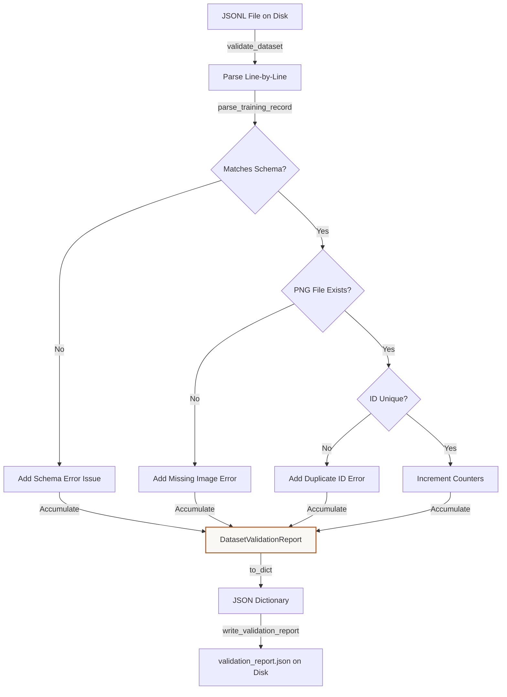

# Tutorial: Dataset Building and Quality Validation
**Files Covered:** [`litevla/data/builder.py`](file:///C:/Projects/Lite-VLA/litevla/data/builder.py), [`litevla/data/validator.py`](file:///C:/Projects/Lite-VLA/litevla/data/validator.py)  
**Epic Milestone:** [Epic 105 / VLA-06: Dataset Generation, Labeling, and Validation]  
**Human-readable version (browser):** [`builder_and_validator.html`](builder_and_validator.html)

---

## 1. Goal & Objective
The goal of the dataset builder and validator is to compile raw simulation steps (PNG visual frames and command streams) into aligned training/validation pairs, augment them with visual variations, partition them, and validate the final dataset layout to guarantee correct formats.

---

## 2. Why We Need It
Training vision-language models requires structured, diverse datasets. Collecting episodes generates irregular timestamps. We need a system that automatically aligns frames with robot actions. Furthermore, training on a few static images causes overfitting. The builder applies data augmentations to introduce variety. Finally, we need a validator to verify there are no missing files or duplicate records before launching training runs.

---

## 3. How to Start Thinking About It (AI Developer Thought Process)
When designing this code, I thought about the developer's sequential decision-making process:

1. **Simulator frames and actions are unaligned:** "First, I realized that the Webots simulator outputs raw image frames and action command streams independently at different times. I need a way to align each frame to what the robot was actually doing at that exact moment. So, I decided to compare timestamps and pair each frame with the latest command that occurred at or before the frame was taken."
2. **We need more image variety:** "Next, I realized that static target images (e.g. 5 standard reference poses) are too easy to memorize. The model will overfit. So, I decided to use PIL's enhancements (`ImageEnhance.Brightness`, `ImageEnhance.Contrast`, etc.) and numpy random noise to generate 25 synthetic variants of each base image to simulate diverse real-world environment lighting."
3. **Partitioning needs reproducibility:** "Then, I wanted to split the compiled records into train and validation sets (90/10 split). If we use a standard random shuffle, the splits will be different every time we run the script, making it impossible to compare training runs. So, I decided to use a local `random.Random(seed)` with a fixed seed to guarantee deterministic shuffling."
4. **Validating before training saves time:** "Finally, I realized that launching training is a multi-hour commitment. If a single PNG is missing or a key is wrong, PyTorch will crash hours later. So, I decided to write an automated validator that scans every line in the final JSONL, checks file existence on disk, counts commands to warn about imbalances, and creates an audit report."

---

## 4. Imports & Global Constants Explained

### Imports Table

| Import Statement | What it is | Why it is used here | Concept Link |
|------------------|------------|---------------------|--------------|
| `import hashlib` | Hash digest builder | Generates unique hashes to seed local random generators. | [Hashlib](../concepts/python_primer.md#hashing-with-hashlib) |
| `import json` | Standard JSON utility | Reads JSON files (like the reference image manifest). | [JSON](../concepts/python_primer.md#json-serialization) |
| `import random` | Random number generator | Shuffles the records list and creates variations. | [Randomness](../concepts/python_primer.md#deterministic-randomness) |
| `import re` | Regular expressions parser | Extracts sim stamp values from frame filenames. | [Regex](../concepts/python_primer.md#regular-expressions) |
| `from collections import Counter` | Counting helper | Computes action category totals for imbalance checks. | [Sorting](../concepts/python_primer.md#sorting-and-lambdas) |
| `from pathlib import Path` | Path resolution utility | Resolves relative image locations across platforms. | [Pathlib](../concepts/python_primer.md#pathlib-file-resolution) |
| `from PIL import Image` | Python Imaging Library | Opens, enhancements, and saves visual frames. | N/A |
| `from PIL import ImageEnhance, ImageFilter` | Image filter enhancers | Alters brightness, contrast, sharping, and blurs. | N/A |
| `import numpy as np` | Multi-dimensional arrays | Performs visual matrix adjustments and handles noise overlays. | N/A |
| `from litevla.data.schema import TrainingRecord` | Dataclass definition | Creates type-safe records for the output files. | [Dataclasses](../concepts/python_primer.md#dataclasses-and-fields) |

### Global Constants

#### `DEFAULT_MAX_VARIANTS_PER_IMAGE`
* **What it is:** Limits the number of augmented variations generated per reference image (capped at 25).
* **Why it is defined here:** Prevents a single image from dominating the dataset.

#### `FRAME_STAMP_RE`
* **What it is:** Regex pattern checking that frame names match the form `<seconds>_<nanoseconds>.png`.
* [Regex Concept Reference](../concepts/python_primer.md#regular-expressions)

#### `IMBALANCE_WARNING_RATIO`
* **What it is:** The ratio (0.50) above which a single action warning is flagged.
* **Why it is defined here:** If one command is >50% of the dataset, it warns the user of bias.

---

## 5. Class Data-Flow Diagrams

### `DatasetValidationReport` Generation & Accumulation Flow

---

## 6. Detailed Code Walkthrough

### Custom Classes

#### `ReferenceEntry`
* **Intent:** Represents a single reference photo row description.
* **Data Contract:** Holds `filename`, `instruction`, and `action` strings.

#### `ReferenceManifest`
* **Intent:** Holds an episode ID, world descriptor, and a list of `ReferenceEntry` records.
* **Why it's chosen:** Organizes multiple target images into a clean configuration block.

#### `BuildStats`
* **Intent:** Accumulates record count diagnostics during dataset compilation.

#### `BuildResult`
* **Intent:** Holds final build outputs (train path, validation path, splits counts, and stats).

#### `ValidationIssue`
* **Intent:** Holds description details for a single schema/file failure.
* **Data Contract:** Defines `severity` (error/warning), `code`, `message`, `line`, and `record_id`.

#### `DatasetValidationReport`
* **Intent:** Holds the overall results of a validation audit.
* **Why it's chosen:** Implements a `@property` named `valid` that returns `True` only if `error_count == 0`, making validation checks easy to check.

---

### Functions in `builder.py`

#### `repo_relative(path, *, repo_root)`
* **Intent:** Translates an absolute system path into a POSIX repo-relative string using forward slashes.
* **Data Contract:** Inputs: absolute `Path`, optional `repo_root`. Outputs: `str` relative path.
* **Why it's chosen:** Using relative paths guarantees that the dataset compiles and runs on any developer's machine.

#### `parse_frame_stamp(filename)`
* **Intent:** Extracts simulation seconds and nanoseconds from a frame name.
* **Data Contract:** Inputs: `str` filename. Outputs: `tuple[int, int] | None`.
* **Why it's chosen:** Uses `FRAME_STAMP_RE` to match and extract numeric values using regex capture groups.

#### `sim_stamp_to_ns(sim_sec, sim_nanosec)`
* **Intent:** Converts seconds and nanoseconds into total nanoseconds.

#### `load_reference_manifest(path)`
* **Intent:** Reads and parses the reference image configuration JSON file.
* **Data Contract:** Inputs: manifest path. Outputs: `ReferenceManifest`.

#### `read_raw_commands(path)`
* **Intent:** Reads raw JSONL commands.
* **Data Contract:** Inputs: directory `Path`. Outputs: `list[dict]` sorted by time.
* **Why it's chosen:** Uses `sorted` with a lambda to order commands chronologically, ensuring correct timestamp matching.
* [Sorting Concept Reference](../concepts/python_primer.md#sorting-and-lambdas)

#### `_action_at_sim_time(commands, sim_ns)`
* **Intent:** Pairs each camera frame with the latest command that occurred at or before the frame was taken.
* **Data Contract:** Inputs: commands sequence, simulation time. Outputs: matched command dict.

#### `records_from_raw_episode(episode_dir)`
* **Intent:** Compiles and labels raw simulation runs.
* **Data Contract:** Inputs: episode path. Outputs: list of records.

#### `_augmentation_rng(seed, stem, variant)`
* **Intent:** Creates a local random generator that is unique to each image and variant.
* **Data Contract:** Inputs: seed int, image stem string, variant index. Outputs: local `random.Random` instance.
* **Why it's chosen:** Uses SHA-256 to hash the image properties together, ensuring that each variant uses a unique seed.
* [Deterministic Randomness Concept Reference](../concepts/python_primer.md#deterministic-randomness)

#### `_apply_augmentation(image, variant, rng)`
* **Intent:** Applies visual changes to an image to simulate diverse real-world lighting.
* **Data Contract:** Inputs: PIL `Image`, variant count, local `random.Random` generator. Outputs: Augmented PIL `Image`.
* **Why it's chosen:** Brightness, contrast, and scaling parameters are randomly selected using `rng.uniform`. Adds Gaussian noise to arrays using NumPy.
* [Pathlib Concept Reference](../concepts/python_primer.md#pathlib-file-resolution)

#### `split_records(records, *, val_ratio, seed)`
* **Intent:** Shuffles and partitions data into train/val sets.
* **Data Contract:** Inputs: records, float ratio, seed. Outputs: train list, val list.
* **Why it's chosen:** Shuffles using a local random instance to ensure reproducibility.

#### `build_starter_dataset(...)`
* **Intent:** The main compiler function. Combines raw runs and reference photos, applies augmentations, verifies schemas, splits files, and writes the output files.
* **Data Contract:** Inputs: version code, threshold counts, ratios, seeds. Outputs: `BuildResult`.

---

### Functions in `validator.py`

#### `resolve_image_path(image_path, *, repo_root)`
* **Intent:** Resolves relative image paths.
* **Data Contract:** Inputs: path string, repo root. Outputs: absolute `Path`.

#### `validate_dataset(...)`
* **Intent:** Audits a processed JSONL file line-by-line for structural issues.
* **Data Contract:** Inputs: JSONL path, check flags. Outputs: `DatasetValidationReport`.
* **Why it's chosen:** Loops through JSONL rows. Checks path existence using `is_file()` and checks for duplicate IDs using a mapping.

#### `write_validation_report(report, output_path)`
* **Intent:** Writes the validation report to disk.

#### `format_report_summary(report)`
* **Intent:** Formats a summary screen for command-line output.
