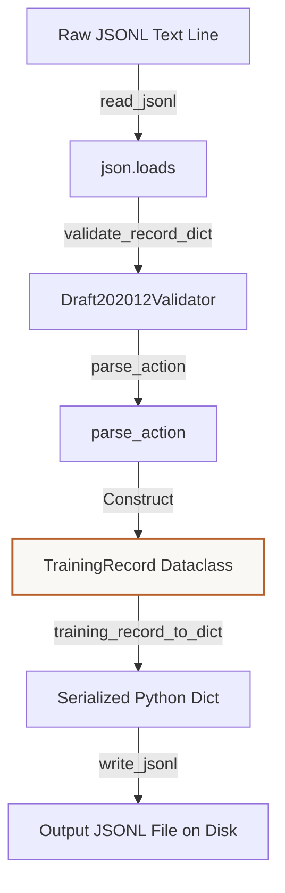
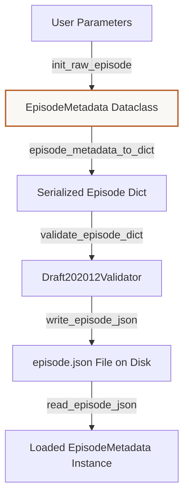

# Tutorial: Understanding Lite-VLA Data Schemas & File Layouts
**Files Covered:** [`litevla/data/schema.py`](file:///C:/Projects/Lite-VLA/litevla/data/schema.py), [`litevla/data/episode.py`](file:///C:/Projects/Lite-VLA/litevla/data/episode.py)  
**Epic Milestone:** [Epic 105 / VLA-06: Dataset Generation, Labeling, and Validation]  
**Human-readable version (browser):** [`schema_and_episode.html`](schema_and_episode.html)

---

## 1. Goal & Objective
The goal of the schema and episode modules is to define a strict, validated data format that maps physical robot inputs (camera image frames, user goals) and outputs (speed commands) into structured, read-only formats for our ML pipelines.

---

## 2. Why We Need It
During fine-tuning, the model consumes thousands of training records. In Python, raw dictionaries are loose, allowing silent typos (like writing `"img_path"` instead of `"image_path"`) or invalid speed commands to go unnoticed. Without this schema gate, invalid actions or missing files would cause GPU training processes to crash after running for hours, wasting computational resources and making debugging difficult. We need a hard boundary that fails fast at the ingestion stage.

---

## 3. How to Start Thinking About It (AI Developer Thought Process)
When designing this code, I thought about the developer's sequential decision-making process:

1. **A loose dictionary is too risky:** "First, I thought about how we need to represent a single dataset item. A simple Python dictionary is too loose because we can write typos in the keys, and the program will continue running anyway. I need to define a strict data schema."
2. **Dataclass for safety:** "Then, I wanted to lock down mutations so that training records cannot be accidentally changed by loaders during training. So, I decided to use a Python `@dataclass` with `frozen=True`."
3. **JSON Schema for checking text structures:** "After that, I needed to check raw JSON data before loading it into memory. So, I decided to write JSON schema blueprint files and validate raw dictionaries using `jsonschema`'s Draft 2020-12 validator before converting them to dataclass objects."
4. **Action parsing validation:** "Next, I realized that checking schemas only validates strings, not the specific action values. So, I decided to import `parse_action` to make sure each action string maps to a valid system steering word (like `MOVE_FORWARD`)."
5. **Memory-efficient loading:** "Finally, when writing the file reader, I realized that datasets could have 10,000+ lines. Reading the entire file into a list would hog memory. Therefore, I chose to use Python's `yield` generator syntax so that we only load one record into memory at a time."

---

## 4. Imports & Global Constants Explained

### Imports Table

| Import Statement | What it is | Why it is used here | Concept Link |
|------------------|------------|---------------------|--------------|
| `from __future__ import annotations` | Postponed type hints | Solves self-referencing classes in type hints. | [Annotations](../concepts/python_primer.md#postponed-annotations) |
| `import json` | Standard JSON parser | Used to read and write raw JSON/JSONL rows. | [JSON Serialization](../concepts/python_primer.md#json-serialization) |
| `from dataclasses import dataclass, field` | Boilerplate helper | Defines the structured, read-only data structures for records. | [Dataclasses](../concepts/python_primer.md#dataclasses-and-fields) |
| `from datetime import datetime, timezone` | Time formatting tools | Formats UTC timestamps for raw episodes. | N/A |
| `from pathlib import Path` | Cross-platform file paths | Handles directory paths, resolving slashes correctly on Windows and Linux. | [Pathlib](../concepts/python_primer.md#pathlib-file-resolution) |
| `from typing import Any, Iterator` | Type annotation tools | Declares return types for dictionaries (`Any`) and generators (`Iterator`). | [Typing](../concepts/python_primer.md#typing-and-type-checking) |
| `import jsonschema` | Draft schema validator | Checks that incoming dictionaries contain all mandatory variables. | [JSON Schema](../concepts/python_primer.md#json-schema-validation) |
| `from jsonschema import Draft202012Validator` | Strict validator class | Implements the official Draft-2020 JSON Schema validator engine. | [JSON Schema](../concepts/python_primer.md#json-schema-validation) |
| `from litevla.actions import parse_action` | Action word validator | Converts string actions (e.g. `"MOVE_FORWARD"`) to verified system commands. | N/A |

### Global Constants

#### `REPO_ROOT`
* **What it is:** Resolves the absolute parent directory of the active Lite-VLA repository.
* **Why it is defined here:** Resolves directories relative to the active file's location on disk, ensuring absolute paths are computed correctly on other developers' machines.
* [Pathlib Concept Reference](../concepts/python_primer.md#pathlib-file-resolution)

#### `RECORD_SCHEMA_PATH`
* **What it is:** Absolute path to the JSON Schema contract for training records.
* **Why it is defined here:** Tells the validator exactly where to find the contract file.

#### `FIXTURES_PATH`
* **What it is:** Path to sample mock dataset files for testing.

#### `EPISODE_SCHEMA_PATH`
* **What it is:** Absolute path to the JSON Schema contract for simulator episodes.

#### `DEFAULT_RAW_EPISODES_DIR`
* **What it is:** The default directory where simulator records are saved (`data/raw/episodes`).

---

## 5. Class Data-Flow Diagrams

### `TrainingRecord` Ingestion & Export Flow



### `EpisodeMetadata` Generation & Loading Flow



---

## 6. Detailed Code Walkthrough

### Custom Classes

#### `TrainingRecord`
* **Intent:** Represents a single image-prompt-action pair for training.
* **Code Snippet:**
  ```python
  @dataclass(frozen=True)
  class TrainingRecord:
      image_path: str
      instruction: str
      action: str
      timestamp: str
      source: str
      id: str | None = None
      episode_id: str | None = None
      metadata: dict[str, Any] = field(default_factory=dict)
  ```
* **Data Contract:** 
  * Inputs: mandatory strings (`image_path`, `instruction`, `action`, `timestamp`, `source`), optional IDs (`id`, `episode_id`), and an optional `metadata` dictionary.
  * Outputs: An immutable record instance.
* **Why it's written this way:** `frozen=True` guarantees that once a record is parsed, its values cannot be modified during training. `field(default_factory=dict)` is used because standard mutable default parameters like `metadata: dict = {}` are shared across all class instances in Python, which leads to memory leaks.
* **System Connections:** Created by `parse_training_record`, read by the `LiteVLADataset` loader.
* [Dataclasses Concept Reference](../concepts/python_primer.md#dataclasses-and-fields)

#### `EpisodeMetadata`
* **Intent:** Represents the metadata description for a raw simulator run.
* **Code Snippet:**
  ```python
  @dataclass(frozen=True)
  class EpisodeMetadata:
      episode_id: str
      instruction: str
      source: str
      world: str
      started_at: str
      record_frames_hz: float
      schema_version: str = "1"
      notes: str | None = None
  ```
* **Data Contract:** Holds simulator parameters (`episode_id`, `instruction`, `source`, `world`, `started_at`, `record_frames_hz`, `notes`).
* **Why it's written this way:** Ensures all simulator runs record the world configuration and frame rate identically.
* **System Connections:** Written to `episode.json` inside the simulator directory.

#### `RecordSchemaError` & `EpisodeSchemaError`
* **Intent:** Custom exceptions raised when validation fails.
* **Why it's written this way:** Inherits from `ValueError`. This allows training scripts to catch and handle schema validation errors specifically.
* [Custom Exceptions Concept Reference](../concepts/python_primer.md#custom-exceptions)

---

### Functions in `schema.py`

#### `record_schema_path()`
* **Intent:** Computes the path to the record schema file.
* **Data Contract:** Inputs: None. Outputs: `Path`.

#### `load_record_schema()`
* **Intent:** Reads and parses the validation schema file from disk.
* **Data Contract:** Inputs: None. Outputs: `dict[str, Any]`.
* **Why it's written this way:** Checks if the file exists using `is_file()` and raises a descriptive `FileNotFoundError` if missing.

#### `_format_validation_error(error)`
* **Intent:** Converts a validation error into a readable path string (e.g. `metadata -> world: ...`).
* **Data Contract:** Inputs: `jsonschema.ValidationError`. Outputs: `str`.

#### `validate_record_dict(raw, *, schema)`
* **Intent:** Validates a raw dictionary against the JSON schema rules.
* **Data Contract:** Inputs: `raw` dict, optional `schema` dict. Outputs: None (raises `RecordSchemaError` if invalid).
* **Why it's chosen:** Uses `Draft202012Validator.iter_errors` to collect all violations, formats them using `_format_validation_error`, and joins them into a single error string.
* [JSON Schema Concept Reference](../concepts/python_primer.md#json-schema-validation)

#### `parse_training_record(raw, *, schema)`
* **Intent:** Converts a raw dict into a validated `TrainingRecord` object.
* **Data Contract:** Inputs: `raw` dict, optional `schema`. Outputs: `TrainingRecord`.
* **Why it's chosen:** Gatekeeper function. Converts raw actions into verified steering commands using `parse_action`.

#### `training_record_to_dict(record)`
* **Intent:** Converts a `TrainingRecord` back into a dictionary for JSON output.
* **Data Contract:** Inputs: `TrainingRecord`. Outputs: `dict[str, Any]`.

#### `read_jsonl(path, *, schema)`
* **Intent:** Streams validated records from a JSONL file line-by-line.
* **Data Contract:** Inputs: `path` to file, optional `schema`. Outputs: `Iterator[TrainingRecord]` generator.
* **Why it's chosen:** Uses `yield` to load files sequentially, keeping memory usage constant.
* [Generators Concept Reference](../concepts/python_primer.md#generators-and-yield)

#### `write_jsonl(path, records)`
* **Intent:** Saves records into a compact JSONL file.
* **Data Contract:** Inputs: target file path, iterator of records. Outputs: `int` (total row count written).

---

### Functions in `episode.py`

#### `episode_schema_path()`
* **Intent:** Computes the path to the episode schema file.

#### `load_episode_schema()`
* **Intent:** Reads the episode schema file from disk.

#### `new_episode_id(when)`
* **Intent:** Generates a UTC directory-safe episode ID.
* **Data Contract:** Inputs: optional `datetime`. Outputs: `str` ID (e.g. `20260705T200000Z`).

#### `validate_episode_dict(raw, *, schema)`
* **Intent:** Validates simulator episode metadata.
* **Data Contract:** Inputs: raw dict, optional schema. Outputs: None.

#### `episode_metadata_to_dict(meta)`
* **Intent:** Converts `EpisodeMetadata` to a dictionary.

#### `write_episode_json(episode_dir, meta)`
* **Intent:** Writes `episode.json` file inside the episode directory.
* **Data Contract:** Inputs: target directory `Path`, `EpisodeMetadata`. Outputs: `Path` to the saved file.

#### `init_raw_episode(...)`
* **Intent:** Sets up a new episode folder on disk with `episode.json` and a `frames/` subdirectory.
* **Data Contract:** Inputs: optional base directory, instruction text, source name, world name, recording frequency, optional episode ID, notes. Outputs: `Path` to the created episode directory.
* **Why it's chosen:** Standardizes folder creation. Ensures the folder and its `frames` directory exist using `mkdir(parents=True, exist_ok=True)`.

#### `frame_filename(sim_stamp_sec, sim_stamp_nanosec)`
* **Intent:** Generates a padded PNG frame filename (e.g. `12_340000000.png`).
* **Data Contract:** Inputs: seconds `int`, nanoseconds `int`. Outputs: `str` filename.
* **Why it's chosen:** Uses `:09d` to pad nanoseconds with zeros, ensuring files are ordered correctly.

#### `read_episode_json(episode_dir)`
* **Intent:** Reads and validates `episode.json` from a directory.
* **Data Contract:** Inputs: directory path. Outputs: `EpisodeMetadata`.
